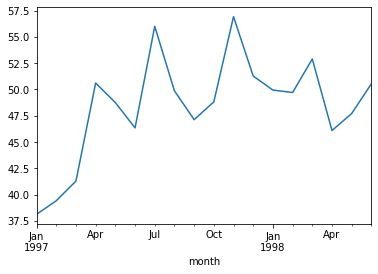
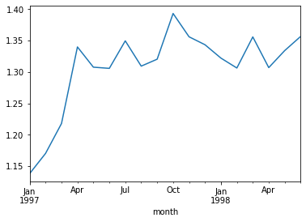
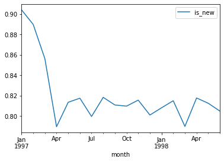

#  单车案例

这是一份用户消费行为的分析报告，数据：某单车网站用户的消费记录

目录：

* 项目背景
* 分析目标
* 分析过程
* 小结

## 一、项目背景

CDNOW是美国的一家网上唱片公司，成立于1994年，后来被贝塔斯曼音乐集团收购。

## 二、分析目标

本次分析报告的数据来源于这家CD网站上的用户消费记录，旨在分析用户消费行为，建立RFM模型，分析复购率、回购率等关键指标。

## 三、分析过程

* 准备工作（数据集观察与数据清洗）
* 用户消费趋势分析（按月）——每月消费总金额、消费次数、产品购买量、消费人数、用户平均消费金额、用户平均消费次数
* 用户个体消费分析——用户消费金额，产品购买量的描述性统计、用户消费金额和产品购买量分布、用户累计消费金额占比
* 用户消费行为分析——用户第一次消费（首购）时间分布、用户最后一次消费时间分布、新老用户占比、用户分层RFM模型、各类用户（新用户、活跃用户、流失用户、回流用户）数量和占比、用户购买周期、用户生命周期
* 用户复购率和回购率分析——复购率、回购率

### 1、准备工作（数据集观察与数据清洗）

（1）导入常用包


```python
import pandas as pd
import numpy as np
import os 
#结果保存路径
output_path='F:/some_now/pro_output'

if not os.path.exists(output_path):
    os.makedirs(output_path)
```

（2）导入数据集

数据集为txt文件格式，没有列名，并且字段之间使用多个空格进行分隔。

这里读取文件时使用sep='\s+'，如果在分隔符里存在多个字符串，可以用s+，+类似于正则匹配，无论分隔符有多少个空格都可以自动处理。


```python
datafile_path='F:/some_now/datafrog/bicyle_master.csv'

columns=['user_id','order_dt','order_products','order_amount']
df=pd.read_table('F:/some_now/datafrog/bicycle_master.txt',names=columns,sep='\s+')
```

* user_id：用户ID
* order_dt:购买日期
* order_products：购买产品数
* order_amount：购买金额


```python
df.info()
```

    <class 'pandas.core.frame.DataFrame'>
    RangeIndex: 69659 entries, 0 to 69658
    Data columns (total 4 columns):
     #   Column          Non-Null Count  Dtype  
    ---  ------          --------------  -----  
     0   user_id         69659 non-null  int64  
     1   order_dt        69659 non-null  int64  
     2   order_products  69659 non-null  int64  
     3   order_amount    69659 non-null  float64
    dtypes: float64(1), int64(3)
    memory usage: 2.1 MB
    


```python
df.head(2).append(df.tail())
```


<div>
<style scoped>
    .dataframe tbody tr th:only-of-type {
        vertical-align: middle;
    }

    .dataframe tbody tr th {
        vertical-align: top;
    }

    .dataframe thead th {
        text-align: right;
    }
</style>
<table border="1" class="dataframe">
  <thead>
    <tr style="text-align: right;">
      <th></th>
      <th>user_id</th>
      <th>order_dt</th>
      <th>order_products</th>
      <th>order_amount</th>
    </tr>
  </thead>
  <tbody>
    <tr>
      <th>0</th>
      <td>1</td>
      <td>19970101</td>
      <td>1</td>
      <td>11.77</td>
    </tr>
    <tr>
      <th>1</th>
      <td>2</td>
      <td>19970112</td>
      <td>1</td>
      <td>12.00</td>
    </tr>
    <tr>
      <th>69654</th>
      <td>23568</td>
      <td>19970405</td>
      <td>4</td>
      <td>83.74</td>
    </tr>
    <tr>
      <th>69655</th>
      <td>23568</td>
      <td>19970422</td>
      <td>1</td>
      <td>14.99</td>
    </tr>
    <tr>
      <th>69656</th>
      <td>23569</td>
      <td>19970325</td>
      <td>2</td>
      <td>25.74</td>
    </tr>
    <tr>
      <th>69657</th>
      <td>23570</td>
      <td>19970325</td>
      <td>3</td>
      <td>51.12</td>
    </tr>
    <tr>
      <th>69658</th>
      <td>23570</td>
      <td>19970326</td>
      <td>2</td>
      <td>42.96</td>
    </tr>
  </tbody>
</table>
</div>


```python
df.describe()
```


<div>
<style scoped>
    .dataframe tbody tr th:only-of-type {
        vertical-align: middle;
    }

    .dataframe tbody tr th {
        vertical-align: top;
    }

    .dataframe thead th {
        text-align: right;
    }
</style>
<table border="1" class="dataframe">
  <thead>
    <tr style="text-align: right;">
      <th></th>
      <th>user_id</th>
      <th>order_dt</th>
      <th>order_products</th>
      <th>order_amount</th>
    </tr>
  </thead>
  <tbody>
    <tr>
      <th>count</th>
      <td>69659.000000</td>
      <td>6.965900e+04</td>
      <td>69659.000000</td>
      <td>69659.000000</td>
    </tr>
    <tr>
      <th>mean</th>
      <td>11470.854592</td>
      <td>1.997228e+07</td>
      <td>2.410040</td>
      <td>35.893648</td>
    </tr>
    <tr>
      <th>std</th>
      <td>6819.904848</td>
      <td>3.837735e+03</td>
      <td>2.333924</td>
      <td>36.281942</td>
    </tr>
    <tr>
      <th>min</th>
      <td>1.000000</td>
      <td>1.997010e+07</td>
      <td>1.000000</td>
      <td>0.000000</td>
    </tr>
    <tr>
      <th>25%</th>
      <td>5506.000000</td>
      <td>1.997022e+07</td>
      <td>1.000000</td>
      <td>14.490000</td>
    </tr>
    <tr>
      <th>50%</th>
      <td>11410.000000</td>
      <td>1.997042e+07</td>
      <td>2.000000</td>
      <td>25.980000</td>
    </tr>
    <tr>
      <th>75%</th>
      <td>17273.000000</td>
      <td>1.997111e+07</td>
      <td>3.000000</td>
      <td>43.700000</td>
    </tr>
    <tr>
      <th>max</th>
      <td>23570.000000</td>
      <td>1.998063e+07</td>
      <td>99.000000</td>
      <td>1286.010000</td>
    </tr>
  </tbody>
</table>
</div>


可以发现：
* 订单的均值为2.4，这表明该批数据的订单消费量少，但是受极值（比如最大值99，最小值1）的影响。
* 用户的消费金额中位数为25元，也存在极值的干扰。

对int类型的字段order_dt转换为日期格式


```python
df['order_dt']
```


    0        19970101
    1        19970112
    2        19970112
    3        19970102
    4        19970330
               ...   
    69654    19970405
    69655    19970422
    69656    19970325
    69657    19970325
    69658    19970326
    Name: order_dt, Length: 69659, dtype: int64


```python
#转换格式后
df['order_dt']=pd.to_datetime(df.order_dt,format='%Y%m%d')
df['order_dt']
```


    0       1997-01-01
    1       1997-01-12
    2       1997-01-12
    3       1997-01-02
    4       1997-03-30
               ...    
    69654   1997-04-05
    69655   1997-04-22
    69656   1997-03-25
    69657   1997-03-25
    69658   1997-03-26
    Name: order_dt, Length: 69659, dtype: datetime64[ns]


```python
df['month']=df['order_dt'].astype('datetime64[M]')
df['month']
```


    0       1997-01-01
    1       1997-01-01
    2       1997-01-01
    3       1997-01-01
    4       1997-03-01
               ...    
    69654   1997-04-01
    69655   1997-04-01
    69656   1997-03-01
    69657   1997-03-01
    69658   1997-03-01
    Name: month, Length: 69659, dtype: datetime64[ns]


```python
df.head(3)
```


<div>
<style scoped>
    .dataframe tbody tr th:only-of-type {
        vertical-align: middle;
    }

    .dataframe tbody tr th {
        vertical-align: top;
    }

    .dataframe thead th {
        text-align: right;
    }
</style>
<table border="1" class="dataframe">
  <thead>
    <tr style="text-align: right;">
      <th></th>
      <th>user_id</th>
      <th>order_dt</th>
      <th>order_products</th>
      <th>order_amount</th>
      <th>month</th>
    </tr>
  </thead>
  <tbody>
    <tr>
      <th>0</th>
      <td>1</td>
      <td>1997-01-01</td>
      <td>1</td>
      <td>11.77</td>
      <td>1997-01-01</td>
    </tr>
    <tr>
      <th>1</th>
      <td>2</td>
      <td>1997-01-12</td>
      <td>1</td>
      <td>12.00</td>
      <td>1997-01-01</td>
    </tr>
    <tr>
      <th>2</th>
      <td>2</td>
      <td>1997-01-12</td>
      <td>5</td>
      <td>77.00</td>
      <td>1997-01-01</td>
    </tr>
  </tbody>
</table>
</div>


### 2、进行用户消费趋势的分析（按月）
* 每月的消费总额
* 每月的消费次数
* 每月的产品购买量
* 每月的消费人数


```python
df.groupby('month')
```


    <pandas.core.groupby.generic.DataFrameGroupBy object at 0x000001C0F23F0D88>


```python
#月消费金额
df.groupby('month')['order_amount'].sum()
```


    month
    1997-01-01    299060.17
    1997-02-01    379590.03
    1997-03-01    393155.27
    1997-04-01    142824.49
    1997-05-01    107933.30
    1997-06-01    108395.87
    1997-07-01    122078.88
    1997-08-01     88367.69
    1997-09-01     81948.80
    1997-10-01     89780.77
    1997-11-01    115448.64
    1997-12-01     95577.35
    1998-01-01     76756.78
    1998-02-01     77096.96
    1998-03-01    108970.15
    1998-04-01     66231.52
    1998-05-01     70989.66
    1998-06-01     76109.30
    Name: order_amount, dtype: float64


```python
grouped_month=df.groupby('month')

#按month进行分组后，对不同的列采用不同的聚合方法
grouped_month_info=grouped_month.agg({'order_amount':'sum','user_id':'count','order_products':'sum'})

grouped_month_info.head(5)
```


```python
grouped_month_info.rename(columns = {'order_amount':'消费金额', 'user_id': '消费次数', 
                                     'order_products': '产品购买量'}, inplace=True)
grouped_month_info
```


<div>
<style scoped>
    .dataframe tbody tr th:only-of-type {
        vertical-align: middle;
    }

    .dataframe tbody tr th {
        vertical-align: top;
    }

    .dataframe thead th {
        text-align: right;
    }
</style>
<table border="1" class="dataframe">
  <thead>
    <tr style="text-align: right;">
      <th></th>
      <th>消费金额</th>
      <th>消费次数</th>
      <th>产品购买量</th>
    </tr>
    <tr>
      <th>month</th>
      <th></th>
      <th></th>
      <th></th>
    </tr>
  </thead>
  <tbody>
    <tr>
      <th>1997-01-01</th>
      <td>299060.17</td>
      <td>8928</td>
      <td>19416</td>
    </tr>
    <tr>
      <th>1997-02-01</th>
      <td>379590.03</td>
      <td>11272</td>
      <td>24921</td>
    </tr>
    <tr>
      <th>1997-03-01</th>
      <td>393155.27</td>
      <td>11598</td>
      <td>26159</td>
    </tr>
    <tr>
      <th>1997-04-01</th>
      <td>142824.49</td>
      <td>3781</td>
      <td>9729</td>
    </tr>
    <tr>
      <th>1997-05-01</th>
      <td>107933.30</td>
      <td>2895</td>
      <td>7275</td>
    </tr>
    <tr>
      <th>1997-06-01</th>
      <td>108395.87</td>
      <td>3054</td>
      <td>7301</td>
    </tr>
    <tr>
      <th>1997-07-01</th>
      <td>122078.88</td>
      <td>2942</td>
      <td>8131</td>
    </tr>
    <tr>
      <th>1997-08-01</th>
      <td>88367.69</td>
      <td>2320</td>
      <td>5851</td>
    </tr>
    <tr>
      <th>1997-09-01</th>
      <td>81948.80</td>
      <td>2296</td>
      <td>5729</td>
    </tr>
    <tr>
      <th>1997-10-01</th>
      <td>89780.77</td>
      <td>2562</td>
      <td>6203</td>
    </tr>
    <tr>
      <th>1997-11-01</th>
      <td>115448.64</td>
      <td>2750</td>
      <td>7812</td>
    </tr>
    <tr>
      <th>1997-12-01</th>
      <td>95577.35</td>
      <td>2504</td>
      <td>6418</td>
    </tr>
    <tr>
      <th>1998-01-01</th>
      <td>76756.78</td>
      <td>2032</td>
      <td>5278</td>
    </tr>
    <tr>
      <th>1998-02-01</th>
      <td>77096.96</td>
      <td>2026</td>
      <td>5340</td>
    </tr>
    <tr>
      <th>1998-03-01</th>
      <td>108970.15</td>
      <td>2793</td>
      <td>7431</td>
    </tr>
    <tr>
      <th>1998-04-01</th>
      <td>66231.52</td>
      <td>1878</td>
      <td>4697</td>
    </tr>
    <tr>
      <th>1998-05-01</th>
      <td>70989.66</td>
      <td>1985</td>
      <td>4903</td>
    </tr>
    <tr>
      <th>1998-06-01</th>
      <td>76109.30</td>
      <td>2043</td>
      <td>5287</td>
    </tr>
  </tbody>
</table>
</div>


```python
df.head(5)
```


<div>
<style scoped>
    .dataframe tbody tr th:only-of-type {
        vertical-align: middle;
    }

    .dataframe tbody tr th {
        vertical-align: top;
    }

    .dataframe thead th {
        text-align: right;
    }
</style>
<table border="1" class="dataframe">
  <thead>
    <tr style="text-align: right;">
      <th></th>
      <th>user_id</th>
      <th>order_dt</th>
      <th>order_products</th>
      <th>order_amount</th>
      <th>month</th>
    </tr>
  </thead>
  <tbody>
    <tr>
      <th>0</th>
      <td>1</td>
      <td>1997-01-01</td>
      <td>1</td>
      <td>11.77</td>
      <td>1997-01-01</td>
    </tr>
    <tr>
      <th>1</th>
      <td>2</td>
      <td>1997-01-12</td>
      <td>1</td>
      <td>12.00</td>
      <td>1997-01-01</td>
    </tr>
    <tr>
      <th>2</th>
      <td>2</td>
      <td>1997-01-12</td>
      <td>5</td>
      <td>77.00</td>
      <td>1997-01-01</td>
    </tr>
    <tr>
      <th>3</th>
      <td>3</td>
      <td>1997-01-02</td>
      <td>2</td>
      <td>20.76</td>
      <td>1997-01-01</td>
    </tr>
    <tr>
      <th>4</th>
      <td>3</td>
      <td>1997-03-30</td>
      <td>2</td>
      <td>20.76</td>
      <td>1997-03-01</td>
    </tr>
  </tbody>
</table>
</div>


```python
grouped_month_info['消费人次']=grouped_month['user_id'].unique().apply(lambda x:len(x))
# grouped_month['user_id'].unique().apply(len)

# grouped_month['user_id'].unique().map(len)
grouped_month_info
```


<div>
<style scoped>
    .dataframe tbody tr th:only-of-type {
        vertical-align: middle;
    }

    .dataframe tbody tr th {
        vertical-align: top;
    }

    .dataframe thead th {
        text-align: right;
    }
</style>
<table border="1" class="dataframe">
  <thead>
    <tr style="text-align: right;">
      <th></th>
      <th>消费金额</th>
      <th>消费次数</th>
      <th>产品购买量</th>
      <th>消费人次</th>
    </tr>
    <tr>
      <th>month</th>
      <th></th>
      <th></th>
      <th></th>
      <th></th>
    </tr>
  </thead>
  <tbody>
    <tr>
      <th>1997-01-01</th>
      <td>299060.17</td>
      <td>8928</td>
      <td>19416</td>
      <td>7846</td>
    </tr>
    <tr>
      <th>1997-02-01</th>
      <td>379590.03</td>
      <td>11272</td>
      <td>24921</td>
      <td>9633</td>
    </tr>
    <tr>
      <th>1997-03-01</th>
      <td>393155.27</td>
      <td>11598</td>
      <td>26159</td>
      <td>9524</td>
    </tr>
    <tr>
      <th>1997-04-01</th>
      <td>142824.49</td>
      <td>3781</td>
      <td>9729</td>
      <td>2822</td>
    </tr>
    <tr>
      <th>1997-05-01</th>
      <td>107933.30</td>
      <td>2895</td>
      <td>7275</td>
      <td>2214</td>
    </tr>
    <tr>
      <th>1997-06-01</th>
      <td>108395.87</td>
      <td>3054</td>
      <td>7301</td>
      <td>2339</td>
    </tr>
    <tr>
      <th>1997-07-01</th>
      <td>122078.88</td>
      <td>2942</td>
      <td>8131</td>
      <td>2180</td>
    </tr>
    <tr>
      <th>1997-08-01</th>
      <td>88367.69</td>
      <td>2320</td>
      <td>5851</td>
      <td>1772</td>
    </tr>
    <tr>
      <th>1997-09-01</th>
      <td>81948.80</td>
      <td>2296</td>
      <td>5729</td>
      <td>1739</td>
    </tr>
    <tr>
      <th>1997-10-01</th>
      <td>89780.77</td>
      <td>2562</td>
      <td>6203</td>
      <td>1839</td>
    </tr>
    <tr>
      <th>1997-11-01</th>
      <td>115448.64</td>
      <td>2750</td>
      <td>7812</td>
      <td>2028</td>
    </tr>
    <tr>
      <th>1997-12-01</th>
      <td>95577.35</td>
      <td>2504</td>
      <td>6418</td>
      <td>1864</td>
    </tr>
    <tr>
      <th>1998-01-01</th>
      <td>76756.78</td>
      <td>2032</td>
      <td>5278</td>
      <td>1537</td>
    </tr>
    <tr>
      <th>1998-02-01</th>
      <td>77096.96</td>
      <td>2026</td>
      <td>5340</td>
      <td>1551</td>
    </tr>
    <tr>
      <th>1998-03-01</th>
      <td>108970.15</td>
      <td>2793</td>
      <td>7431</td>
      <td>2060</td>
    </tr>
    <tr>
      <th>1998-04-01</th>
      <td>66231.52</td>
      <td>1878</td>
      <td>4697</td>
      <td>1437</td>
    </tr>
    <tr>
      <th>1998-05-01</th>
      <td>70989.66</td>
      <td>1985</td>
      <td>4903</td>
      <td>1488</td>
    </tr>
    <tr>
      <th>1998-06-01</th>
      <td>76109.30</td>
      <td>2043</td>
      <td>5287</td>
      <td>1506</td>
    </tr>
  </tbody>
</table>
</div>


```python
"""
为了便于画图，需要重置索引，同时也需要把month转化为str类型，
否则画图时datetime类型的month会在powerbi中会转化为时间戳（在Powerbi中图的布局和格式都会好看一些）
"""
grouped_month_info['month'] = grouped_month_info['month'].astype(str)
grouped_month_info
```


<div>
<style scoped>
    .dataframe tbody tr th:only-of-type {
        vertical-align: middle;
    }

    .dataframe tbody tr th {
        vertical-align: top;
    }

    .dataframe thead th {
        text-align: right;
    }
</style>
<table border="1" class="dataframe">
  <thead>
    <tr style="text-align: right;">
      <th></th>
      <th>month</th>
      <th>消费金额</th>
      <th>消费次数</th>
      <th>产品购买量</th>
      <th>消费人次</th>
    </tr>
  </thead>
  <tbody>
    <tr>
      <th>0</th>
      <td>1997-01-01</td>
      <td>299060.17</td>
      <td>8928</td>
      <td>19416</td>
      <td>7846</td>
    </tr>
    <tr>
      <th>1</th>
      <td>1997-02-01</td>
      <td>379590.03</td>
      <td>11272</td>
      <td>24921</td>
      <td>9633</td>
    </tr>
    <tr>
      <th>2</th>
      <td>1997-03-01</td>
      <td>393155.27</td>
      <td>11598</td>
      <td>26159</td>
      <td>9524</td>
    </tr>
    <tr>
      <th>3</th>
      <td>1997-04-01</td>
      <td>142824.49</td>
      <td>3781</td>
      <td>9729</td>
      <td>2822</td>
    </tr>
    <tr>
      <th>4</th>
      <td>1997-05-01</td>
      <td>107933.30</td>
      <td>2895</td>
      <td>7275</td>
      <td>2214</td>
    </tr>
    <tr>
      <th>5</th>
      <td>1997-06-01</td>
      <td>108395.87</td>
      <td>3054</td>
      <td>7301</td>
      <td>2339</td>
    </tr>
    <tr>
      <th>6</th>
      <td>1997-07-01</td>
      <td>122078.88</td>
      <td>2942</td>
      <td>8131</td>
      <td>2180</td>
    </tr>
    <tr>
      <th>7</th>
      <td>1997-08-01</td>
      <td>88367.69</td>
      <td>2320</td>
      <td>5851</td>
      <td>1772</td>
    </tr>
    <tr>
      <th>8</th>
      <td>1997-09-01</td>
      <td>81948.80</td>
      <td>2296</td>
      <td>5729</td>
      <td>1739</td>
    </tr>
    <tr>
      <th>9</th>
      <td>1997-10-01</td>
      <td>89780.77</td>
      <td>2562</td>
      <td>6203</td>
      <td>1839</td>
    </tr>
    <tr>
      <th>10</th>
      <td>1997-11-01</td>
      <td>115448.64</td>
      <td>2750</td>
      <td>7812</td>
      <td>2028</td>
    </tr>
    <tr>
      <th>11</th>
      <td>1997-12-01</td>
      <td>95577.35</td>
      <td>2504</td>
      <td>6418</td>
      <td>1864</td>
    </tr>
    <tr>
      <th>12</th>
      <td>1998-01-01</td>
      <td>76756.78</td>
      <td>2032</td>
      <td>5278</td>
      <td>1537</td>
    </tr>
    <tr>
      <th>13</th>
      <td>1998-02-01</td>
      <td>77096.96</td>
      <td>2026</td>
      <td>5340</td>
      <td>1551</td>
    </tr>
    <tr>
      <th>14</th>
      <td>1998-03-01</td>
      <td>108970.15</td>
      <td>2793</td>
      <td>7431</td>
      <td>2060</td>
    </tr>
    <tr>
      <th>15</th>
      <td>1998-04-01</td>
      <td>66231.52</td>
      <td>1878</td>
      <td>4697</td>
      <td>1437</td>
    </tr>
    <tr>
      <th>16</th>
      <td>1998-05-01</td>
      <td>70989.66</td>
      <td>1985</td>
      <td>4903</td>
      <td>1488</td>
    </tr>
    <tr>
      <th>17</th>
      <td>1998-06-01</td>
      <td>76109.30</td>
      <td>2043</td>
      <td>5287</td>
      <td>1506</td>
    </tr>
  </tbody>
</table>
</div>


```python
grouped_month_info.to_excel(os.path.join(output_path,'月销售额、销售次数、产品购买量、消费人数.xlsx'))
```


由上图可知，消费金额在前三个月达到最高峰，后续消费较为稳定，有轻微下降趋势。


由上图可知，产品购买量在前三个月达到最高峰，后续较为稳定，有轻微下降趋势


由上图可知，
* 每月消费人次低于每月消费次数，但差异不大。
* 前三个月消费次数在10000笔左右，后续月份的平均消费次数为2500。
* 前三个月每月的消费人次在8000-10000之间，后续月份的平均消费人次不达2000。


```python
#上述的汇总分析，也可以用数据透视表的方法实现
df.pivot_table(index='month'
              ,values=['order_products','order_amount','user_id']
              ,aggfunc={'order_products':'sum'
                       ,'order_amount':'sum'
                       ,'user_id':'count'}).head(5)
```


<div>
<style scoped>
    .dataframe tbody tr th:only-of-type {
        vertical-align: middle;
    }

    .dataframe tbody tr th {
        vertical-align: top;
    }

    .dataframe thead th {
        text-align: right;
    }
</style>
<table border="1" class="dataframe">
  <thead>
    <tr style="text-align: right;">
      <th></th>
      <th>order_amount</th>
      <th>order_products</th>
      <th>user_id</th>
    </tr>
    <tr>
      <th>month</th>
      <th></th>
      <th></th>
      <th></th>
    </tr>
  </thead>
  <tbody>
    <tr>
      <th>1997-01-01</th>
      <td>299060.17</td>
      <td>19416</td>
      <td>8928</td>
    </tr>
    <tr>
      <th>1997-02-01</th>
      <td>379590.03</td>
      <td>24921</td>
      <td>11272</td>
    </tr>
    <tr>
      <th>1997-03-01</th>
      <td>393155.27</td>
      <td>26159</td>
      <td>11598</td>
    </tr>
    <tr>
      <th>1997-04-01</th>
      <td>142824.49</td>
      <td>9729</td>
      <td>3781</td>
    </tr>
    <tr>
      <th>1997-05-01</th>
      <td>107933.30</td>
      <td>7275</td>
      <td>2895</td>
    </tr>
  </tbody>
</table>
</div>


* 每月用户平均消费金额


```python
amount=grouped_month.order_amount.sum()
num=df.groupby('month').user_id.apply(lambda x:len(x.drop_duplicates()))
avg_amount=amount/num
avg_amount.plot()
```


    <matplotlib.axes._subplots.AxesSubplot at 0x1c0f00a3bc8>





由上图可知，每月用户的平均消费金额都在37.5以上，1997年1月份最低，1998年11月最高，最高值为57月左右

* 每月用户平均消费次数


```python
times=grouped_month.user_id.count()
num=df.groupby('month').user_id.apply(lambda x:len(x.drop_duplicates()))
avg_times=times/num
avg_times.plot()
```


    <matplotlib.axes._subplots.AxesSubplot at 0x1c0f1d260c8>





由上图可知，每月用户平均消费次数都在1次以上，1997年1月份最低，1998年10月最高，最高值为1.4次左右

### 2、用户个体消费分析
* 用户消费金额、消费次数的秒速统计
* 用户消费金额和消费次数的散点图
* 用户消费金额的分布图
* 用户消费次数的分布图
* 用户累计消费金额占比（百分之多少的用户占了百分之多少的消费额）


```python
grouped_user=df.groupby('user_id')
grouped_user_info=grouped_user.sum()
grouped_user_info
```


<div>
<style scoped>
    .dataframe tbody tr th:only-of-type {
        vertical-align: middle;
    }

    .dataframe tbody tr th {
        vertical-align: top;
    }

    .dataframe thead th {
        text-align: right;
    }
</style>
<table border="1" class="dataframe">
  <thead>
    <tr style="text-align: right;">
      <th></th>
      <th>order_products</th>
      <th>order_amount</th>
    </tr>
    <tr>
      <th>user_id</th>
      <th></th>
      <th></th>
    </tr>
  </thead>
  <tbody>
    <tr>
      <th>1</th>
      <td>1</td>
      <td>11.77</td>
    </tr>
    <tr>
      <th>2</th>
      <td>6</td>
      <td>89.00</td>
    </tr>
    <tr>
      <th>3</th>
      <td>16</td>
      <td>156.46</td>
    </tr>
    <tr>
      <th>4</th>
      <td>7</td>
      <td>100.50</td>
    </tr>
    <tr>
      <th>5</th>
      <td>29</td>
      <td>385.61</td>
    </tr>
    <tr>
      <th>...</th>
      <td>...</td>
      <td>...</td>
    </tr>
    <tr>
      <th>23566</th>
      <td>2</td>
      <td>36.00</td>
    </tr>
    <tr>
      <th>23567</th>
      <td>1</td>
      <td>20.97</td>
    </tr>
    <tr>
      <th>23568</th>
      <td>6</td>
      <td>121.70</td>
    </tr>
    <tr>
      <th>23569</th>
      <td>2</td>
      <td>25.74</td>
    </tr>
    <tr>
      <th>23570</th>
      <td>5</td>
      <td>94.08</td>
    </tr>
  </tbody>
</table>
<p>23570 rows × 2 columns</p>
</div>


```python
grouped_user.sum().describe()
```


<div>
<style scoped>
    .dataframe tbody tr th:only-of-type {
        vertical-align: middle;
    }

    .dataframe tbody tr th {
        vertical-align: top;
    }

    .dataframe thead th {
        text-align: right;
    }
</style>
<table border="1" class="dataframe">
  <thead>
    <tr style="text-align: right;">
      <th></th>
      <th>order_products</th>
      <th>order_amount</th>
    </tr>
  </thead>
  <tbody>
    <tr>
      <th>count</th>
      <td>23570.000000</td>
      <td>23570.000000</td>
    </tr>
    <tr>
      <th>mean</th>
      <td>7.122656</td>
      <td>106.080426</td>
    </tr>
    <tr>
      <th>std</th>
      <td>16.983531</td>
      <td>240.925195</td>
    </tr>
    <tr>
      <th>min</th>
      <td>1.000000</td>
      <td>0.000000</td>
    </tr>
    <tr>
      <th>25%</th>
      <td>1.000000</td>
      <td>19.970000</td>
    </tr>
    <tr>
      <th>50%</th>
      <td>3.000000</td>
      <td>43.395000</td>
    </tr>
    <tr>
      <th>75%</th>
      <td>7.000000</td>
      <td>106.475000</td>
    </tr>
    <tr>
      <th>max</th>
      <td>1033.000000</td>
      <td>13990.930000</td>
    </tr>
  </tbody>
</table>
</div>


* 由上表可知，用户平均购买的均值为7，但是中位数（50%）只有3，说明小部分用户购买了大量的产品（二八法则）
* 用户平均消费106元，但中位数（50%）只有43，判断同上，但也可以发现是存在极值干扰的。


```python
grouped_user_info.rename(columns={'order_products':'消费产品','order_amount':'消费金额'},inplace=True)

grouped_user_info.to_excel(os.path.join(output_path,'用户个体消费行为分析.xlsx'),index=False)
```


```python
grouped_user_info
```


<div>
<style scoped>
    .dataframe tbody tr th:only-of-type {
        vertical-align: middle;
    }

    .dataframe tbody tr th {
        vertical-align: top;
    }

    .dataframe thead th {
        text-align: right;
    }
</style>
<table border="1" class="dataframe">
  <thead>
    <tr style="text-align: right;">
      <th></th>
      <th>消费产品</th>
      <th>消费金额</th>
    </tr>
    <tr>
      <th>user_id</th>
      <th></th>
      <th></th>
    </tr>
  </thead>
  <tbody>
    <tr>
      <th>1</th>
      <td>1</td>
      <td>11.77</td>
    </tr>
    <tr>
      <th>2</th>
      <td>6</td>
      <td>89.00</td>
    </tr>
    <tr>
      <th>3</th>
      <td>16</td>
      <td>156.46</td>
    </tr>
    <tr>
      <th>4</th>
      <td>7</td>
      <td>100.50</td>
    </tr>
    <tr>
      <th>5</th>
      <td>29</td>
      <td>385.61</td>
    </tr>
    <tr>
      <th>...</th>
      <td>...</td>
      <td>...</td>
    </tr>
    <tr>
      <th>23566</th>
      <td>2</td>
      <td>36.00</td>
    </tr>
    <tr>
      <th>23567</th>
      <td>1</td>
      <td>20.97</td>
    </tr>
    <tr>
      <th>23568</th>
      <td>6</td>
      <td>121.70</td>
    </tr>
    <tr>
      <th>23569</th>
      <td>2</td>
      <td>25.74</td>
    </tr>
    <tr>
      <th>23570</th>
      <td>5</td>
      <td>94.08</td>
    </tr>
  </tbody>
</table>
<p>23570 rows × 2 columns</p>
</div>


```python
grouped_user_info_order_amount=grouped_user_info['消费金额']
grouped_user_info_order_amount

grouped_user_info['消费金额'].max()

grouped_user_info['消费金额'].min()

grouped_user_info_order_amount_lst=[i for i in range(0,int(grouped_user_info_order_amount.max())+50,50)]

grouped_user_info_order_amount_lst

type(grouped_user_sum_order_amount_lst)

"""
pd.cut( series, bins, right=True, labels=None, retbins=False, precision=3, include_lowest=False, duplicates='raise', )
right=True表示分组右边闭合，right=False表示分组左边闭合，
labels表示分组的自定义标签。

labels : 数组或布尔值，可选.指定分箱的标签

如果是数组，长度要与分箱个数一致，比如“ bins”=[1、2、3、4]表示（1,2]，（2,3],（3,4]一共3个区间，则labels的长度也就是标签的个数也要是3
如果为False，则仅返回分箱的整数指示符，即x中的数据在第几个箱子里

"""
#label要比bins少一位数
grouped_user_info_order_amount=pd.cut(grouped_user_info_order_amount,bins=grouped_user_info_order_amount_lst,
                                      labels=grouped_user_info_order_amount_lst[1:])

grouped_user_info_order_amount.to_excel(os.path.join(output_path,'消费金额分布直方图.xlsx'))
```


从直方图可知，用户消费金额，呈现集中趋势，小部分异常值干扰判断，可以使用过滤操作排除异常。

使用切比雪夫定理过滤掉异常值，切比雪夫定理说明，95%的数据都分布在5个标准差之内，剩下5%的极值就不要了。


```python
grouped_user_info['消费金额'].mean()
grouped_user_info['消费金额'].std()
```


    240.92519451637924


order_amount (mean = 106 ,std = 241)  mean+5std = 1311


```python
grouped_user_info_order_products=grouped_user_info['消费产品']
grouped_user_info_order_products
```


    user_id
    1         1
    2         6
    3        16
    4         7
    5        29
             ..
    23566     2
    23567     1
    23568     6
    23569     2
    23570     5
    Name: 消费产品, Length: 23570, dtype: int64


```python
grouped_user_info['消费产品'].max()
```


    1033


```python
grouped_user_info['消费产品'].min()
```


    1


```python
grouped_user_info_order_products_lst=[i for i in range(0,int(grouped_user_info_order_products.max())+50,50)]

grouped_user_info_order_products_lst
```


    [0,
     50,
     100,
     150,
     200,
     250,
     300,
     350,
     400,
     450,
     500,
     550,
     600,
     650,
     700,
     750,
     800,
     850,
     900,
     950,
     1000,
     1050]


```python
type(grouped_user_sum_order_products_lst)

"""
pd.cut( series, bins, right=True, labels=None, retbins=False, precision=3, include_lowest=False, duplicates='raise', )
right=True表示分组右边闭合，right=False表示分组左边闭合，
labels表示分组的自定义标签。

labels : 数组或布尔值，可选.指定分箱的标签

如果是数组，长度要与分箱个数一致，比如“ bins”=[1、2、3、4]表示（1,2]，（2,3],（3,4]一共3个区间，则labels的长度也就是标签的个数也要是3
如果为False，则仅返回分箱的整数指示符，即x中的数据在第几个箱子里

"""
```


```python
#label要比bins少一位数
grouped_user_info_order_products=pd.cut(grouped_user_info_order_products,bins=grouped_user_info_order_products_lst,
                                      labels=grouped_user_info_order_products_lst[1:])
grouped_user_info_order_products
```


    user_id
    1        50
    2        50
    3        50
    4        50
    5        50
             ..
    23566    50
    23567    50
    23568    50
    23569    50
    23570    50
    Name: 消费产品, Length: 23570, dtype: category
    Categories (21, int64): [50 < 100 < 150 < 200 ... 900 < 950 < 1000 < 1050]


```python
grouped_user_info_order_products.to_excel(os.path.join(output_path,'消费次数分布直方图.xlsx'))
```


```python
grouped_user_info['消费产品'].mean()+5*grouped_user_info['消费产品'].std()

```


    92.04031326963036


#### 计算累计消费金额占比 


```python
grouped_user_info.head(5)
```


<div>
<style scoped>
    .dataframe tbody tr th:only-of-type {
        vertical-align: middle;
    }

    .dataframe tbody tr th {
        vertical-align: top;
    }

    .dataframe thead th {
        text-align: right;
    }
</style>
<table border="1" class="dataframe">
  <thead>
    <tr style="text-align: right;">
      <th></th>
      <th>消费产品</th>
      <th>消费金额</th>
    </tr>
    <tr>
      <th>user_id</th>
      <th></th>
      <th></th>
    </tr>
  </thead>
  <tbody>
    <tr>
      <th>1</th>
      <td>1</td>
      <td>11.77</td>
    </tr>
    <tr>
      <th>2</th>
      <td>6</td>
      <td>89.00</td>
    </tr>
    <tr>
      <th>3</th>
      <td>16</td>
      <td>156.46</td>
    </tr>
    <tr>
      <th>4</th>
      <td>7</td>
      <td>100.50</td>
    </tr>
    <tr>
      <th>5</th>
      <td>29</td>
      <td>385.61</td>
    </tr>
  </tbody>
</table>
</div>


```python
grouped_user_info.sort_values('消费金额')
```


<div>
<style scoped>
    .dataframe tbody tr th:only-of-type {
        vertical-align: middle;
    }

    .dataframe tbody tr th {
        vertical-align: top;
    }

    .dataframe thead th {
        text-align: right;
    }
</style>
<table border="1" class="dataframe">
  <thead>
    <tr style="text-align: right;">
      <th></th>
      <th>消费产品</th>
      <th>消费金额</th>
    </tr>
    <tr>
      <th>user_id</th>
      <th></th>
      <th></th>
    </tr>
  </thead>
  <tbody>
    <tr>
      <th>10175</th>
      <td>1</td>
      <td>0.00</td>
    </tr>
    <tr>
      <th>4559</th>
      <td>1</td>
      <td>0.00</td>
    </tr>
    <tr>
      <th>1948</th>
      <td>1</td>
      <td>0.00</td>
    </tr>
    <tr>
      <th>925</th>
      <td>1</td>
      <td>0.00</td>
    </tr>
    <tr>
      <th>10798</th>
      <td>1</td>
      <td>0.00</td>
    </tr>
    <tr>
      <th>...</th>
      <td>...</td>
      <td>...</td>
    </tr>
    <tr>
      <th>7931</th>
      <td>514</td>
      <td>6497.18</td>
    </tr>
    <tr>
      <th>19339</th>
      <td>378</td>
      <td>6552.70</td>
    </tr>
    <tr>
      <th>7983</th>
      <td>536</td>
      <td>6973.07</td>
    </tr>
    <tr>
      <th>14048</th>
      <td>1033</td>
      <td>8976.33</td>
    </tr>
    <tr>
      <th>7592</th>
      <td>917</td>
      <td>13990.93</td>
    </tr>
  </tbody>
</table>
<p>23570 rows × 2 columns</p>
</div>


```python
#cumsum求累加值

grouped_user_info=grouped_user.sum()
user_cumcum=grouped_user_info.sort_values('消费金额').apply(lambda x:x.cumsum()/x.sum())

user_cumcum.reset_index(inplace=True)

user_cumcum.to_excel(os.path.join(output_path,'累计销售情况占比.xlsx'))
```


```python
user_cumcum
```


<div>
<style scoped>
    .dataframe tbody tr th:only-of-type {
        vertical-align: middle;
    }

    .dataframe tbody tr th {
        vertical-align: top;
    }

    .dataframe thead th {
        text-align: right;
    }
</style>
<table border="1" class="dataframe">
  <thead>
    <tr style="text-align: right;">
      <th></th>
      <th>user_id</th>
      <th>消费产品</th>
      <th>消费金额</th>
    </tr>
  </thead>
  <tbody>
    <tr>
      <th>0</th>
      <td>10175</td>
      <td>0.000006</td>
      <td>0.000000</td>
    </tr>
    <tr>
      <th>1</th>
      <td>4559</td>
      <td>0.000012</td>
      <td>0.000000</td>
    </tr>
    <tr>
      <th>2</th>
      <td>1948</td>
      <td>0.000018</td>
      <td>0.000000</td>
    </tr>
    <tr>
      <th>3</th>
      <td>925</td>
      <td>0.000024</td>
      <td>0.000000</td>
    </tr>
    <tr>
      <th>4</th>
      <td>10798</td>
      <td>0.000030</td>
      <td>0.000000</td>
    </tr>
    <tr>
      <th>...</th>
      <td>...</td>
      <td>...</td>
      <td>...</td>
    </tr>
    <tr>
      <th>23565</th>
      <td>7931</td>
      <td>0.982940</td>
      <td>0.985405</td>
    </tr>
    <tr>
      <th>23566</th>
      <td>19339</td>
      <td>0.985192</td>
      <td>0.988025</td>
    </tr>
    <tr>
      <th>23567</th>
      <td>7983</td>
      <td>0.988385</td>
      <td>0.990814</td>
    </tr>
    <tr>
      <th>23568</th>
      <td>14048</td>
      <td>0.994538</td>
      <td>0.994404</td>
    </tr>
    <tr>
      <th>23569</th>
      <td>7592</td>
      <td>1.000000</td>
      <td>1.000000</td>
    </tr>
  </tbody>
</table>
<p>23570 rows × 3 columns</p>
</div>


按照用户消费金额进行升序排序，可以发现50%的用户仅仅贡献了10%左右的消费额度，而排名前20%的用户贡献了60%的消费额度，符合“二八法则”，这表明只要抓住前20%（（用户总数（23569）*80%=18855））的用户，便可达成目标销售额度的大部分，其余80%的客户可以做策略调整。

### 3、用户消费行为 
- 用户第一次消费（首购）
- 用户最后一次消费
- 新老客户消费比
 - 多少用户仅消费一次
 - 每月新客占比
- 用户分层
 - RFM模型
 - 新、老、活跃、回流、流失
- 用户购买周期（按订单）
 - 用户消费周期描述
 - 用户消费周期分布
- 用户生命周期（按第一次和最后一次消费）
 -用户生命周期描述
 - 用户生命周期分布


```python
grouped_user=df.groupby('user_id')
grouped_user
```


    <pandas.core.groupby.generic.DataFrameGroupBy object at 0x000001C0F42497C8>


```python
grouped_user.min()
```


<div>
<style scoped>
    .dataframe tbody tr th:only-of-type {
        vertical-align: middle;
    }

    .dataframe tbody tr th {
        vertical-align: top;
    }

    .dataframe thead th {
        text-align: right;
    }
</style>
<table border="1" class="dataframe">
  <thead>
    <tr style="text-align: right;">
      <th></th>
      <th>order_dt</th>
      <th>order_products</th>
      <th>order_amount</th>
      <th>month</th>
    </tr>
    <tr>
      <th>user_id</th>
      <th></th>
      <th></th>
      <th></th>
      <th></th>
    </tr>
  </thead>
  <tbody>
    <tr>
      <th>1</th>
      <td>1997-01-01</td>
      <td>1</td>
      <td>11.77</td>
      <td>1997-01-01</td>
    </tr>
    <tr>
      <th>2</th>
      <td>1997-01-12</td>
      <td>1</td>
      <td>12.00</td>
      <td>1997-01-01</td>
    </tr>
    <tr>
      <th>3</th>
      <td>1997-01-02</td>
      <td>1</td>
      <td>16.99</td>
      <td>1997-01-01</td>
    </tr>
    <tr>
      <th>4</th>
      <td>1997-01-01</td>
      <td>1</td>
      <td>14.96</td>
      <td>1997-01-01</td>
    </tr>
    <tr>
      <th>5</th>
      <td>1997-01-01</td>
      <td>1</td>
      <td>13.97</td>
      <td>1997-01-01</td>
    </tr>
    <tr>
      <th>...</th>
      <td>...</td>
      <td>...</td>
      <td>...</td>
      <td>...</td>
    </tr>
    <tr>
      <th>23566</th>
      <td>1997-03-25</td>
      <td>2</td>
      <td>36.00</td>
      <td>1997-03-01</td>
    </tr>
    <tr>
      <th>23567</th>
      <td>1997-03-25</td>
      <td>1</td>
      <td>20.97</td>
      <td>1997-03-01</td>
    </tr>
    <tr>
      <th>23568</th>
      <td>1997-03-25</td>
      <td>1</td>
      <td>14.99</td>
      <td>1997-03-01</td>
    </tr>
    <tr>
      <th>23569</th>
      <td>1997-03-25</td>
      <td>2</td>
      <td>25.74</td>
      <td>1997-03-01</td>
    </tr>
    <tr>
      <th>23570</th>
      <td>1997-03-25</td>
      <td>2</td>
      <td>42.96</td>
      <td>1997-03-01</td>
    </tr>
  </tbody>
</table>
<p>23570 rows × 4 columns</p>
</div>


```python
grouped_user_min=grouped_user.min()['order_dt'].value_counts().reset_index().rename(columns={'index':'first_date'})
```


```python
grouped_user_min
```


<div>
<style scoped>
    .dataframe tbody tr th:only-of-type {
        vertical-align: middle;
    }

    .dataframe tbody tr th {
        vertical-align: top;
    }

    .dataframe thead th {
        text-align: right;
    }
</style>
<table border="1" class="dataframe">
  <thead>
    <tr style="text-align: right;">
      <th></th>
      <th>first_date</th>
      <th>order_dt</th>
    </tr>
  </thead>
  <tbody>
    <tr>
      <th>0</th>
      <td>1997-02-08</td>
      <td>363</td>
    </tr>
    <tr>
      <th>1</th>
      <td>1997-02-24</td>
      <td>347</td>
    </tr>
    <tr>
      <th>2</th>
      <td>1997-02-04</td>
      <td>346</td>
    </tr>
    <tr>
      <th>3</th>
      <td>1997-02-06</td>
      <td>346</td>
    </tr>
    <tr>
      <th>4</th>
      <td>1997-03-04</td>
      <td>340</td>
    </tr>
    <tr>
      <th>...</th>
      <td>...</td>
      <td>...</td>
    </tr>
    <tr>
      <th>79</th>
      <td>1997-01-08</td>
      <td>213</td>
    </tr>
    <tr>
      <th>80</th>
      <td>1997-03-21</td>
      <td>213</td>
    </tr>
    <tr>
      <th>81</th>
      <td>1997-01-07</td>
      <td>211</td>
    </tr>
    <tr>
      <th>82</th>
      <td>1997-01-01</td>
      <td>209</td>
    </tr>
    <tr>
      <th>83</th>
      <td>1997-01-04</td>
      <td>174</td>
    </tr>
  </tbody>
</table>
<p>84 rows × 2 columns</p>
</div>


```python
grouped_user_min['first_date']
```


    0    1997-02-08
    1    1997-02-24
    2    1997-02-04
    3    1997-02-06
    4    1997-03-04
            ...    
    79   1997-01-08
    80   1997-03-21
    81   1997-01-07
    82   1997-01-01
    83   1997-01-04
    Name: first_date, Length: 84, dtype: datetime64[ns]


```python
#如果把datetime64类型的first_date传入Powerbi会变成时间戳，为正常显示，需要将其转换为str类型
grouped_user_min['first_date']=grouped_user_min['first_date'].astype(str)
grouped_user_min.to_excel(os.path.join(output_path,'用户首购.xlsx'))
```


```python
grouped_user_min
```


<div>
<style scoped>
    .dataframe tbody tr th:only-of-type {
        vertical-align: middle;
    }

    .dataframe tbody tr th {
        vertical-align: top;
    }

    .dataframe thead th {
        text-align: right;
    }
</style>
<table border="1" class="dataframe">
  <thead>
    <tr style="text-align: right;">
      <th></th>
      <th>first_date</th>
      <th>order_dt</th>
    </tr>
  </thead>
  <tbody>
    <tr>
      <th>0</th>
      <td>1997-02-08</td>
      <td>363</td>
    </tr>
    <tr>
      <th>1</th>
      <td>1997-02-24</td>
      <td>347</td>
    </tr>
    <tr>
      <th>2</th>
      <td>1997-02-04</td>
      <td>346</td>
    </tr>
    <tr>
      <th>3</th>
      <td>1997-02-06</td>
      <td>346</td>
    </tr>
    <tr>
      <th>4</th>
      <td>1997-03-04</td>
      <td>340</td>
    </tr>
    <tr>
      <th>...</th>
      <td>...</td>
      <td>...</td>
    </tr>
    <tr>
      <th>79</th>
      <td>1997-01-08</td>
      <td>213</td>
    </tr>
    <tr>
      <th>80</th>
      <td>1997-03-21</td>
      <td>213</td>
    </tr>
    <tr>
      <th>81</th>
      <td>1997-01-07</td>
      <td>211</td>
    </tr>
    <tr>
      <th>82</th>
      <td>1997-01-01</td>
      <td>209</td>
    </tr>
    <tr>
      <th>83</th>
      <td>1997-01-04</td>
      <td>174</td>
    </tr>
  </tbody>
</table>
<p>84 rows × 2 columns</p>
</div>


```python
#用户最后一次额购买分布统计同理
grouped_user_max=grouped_user.max().order_dt.value_counts().reset_index().rename(columns={'index':'last_date'})
grouped_user_max
```


<div>
<style scoped>
    .dataframe tbody tr th:only-of-type {
        vertical-align: middle;
    }

    .dataframe tbody tr th {
        vertical-align: top;
    }

    .dataframe thead th {
        text-align: right;
    }
</style>
<table border="1" class="dataframe">
  <thead>
    <tr style="text-align: right;">
      <th></th>
      <th>last_date</th>
      <th>order_dt</th>
    </tr>
  </thead>
  <tbody>
    <tr>
      <th>0</th>
      <td>1997-02-08</td>
      <td>221</td>
    </tr>
    <tr>
      <th>1</th>
      <td>1997-03-12</td>
      <td>213</td>
    </tr>
    <tr>
      <th>2</th>
      <td>1997-02-04</td>
      <td>210</td>
    </tr>
    <tr>
      <th>3</th>
      <td>1997-03-06</td>
      <td>204</td>
    </tr>
    <tr>
      <th>4</th>
      <td>1997-02-27</td>
      <td>202</td>
    </tr>
    <tr>
      <th>...</th>
      <td>...</td>
      <td>...</td>
    </tr>
    <tr>
      <th>541</th>
      <td>1997-07-04</td>
      <td>4</td>
    </tr>
    <tr>
      <th>542</th>
      <td>1997-10-19</td>
      <td>4</td>
    </tr>
    <tr>
      <th>543</th>
      <td>1997-07-18</td>
      <td>4</td>
    </tr>
    <tr>
      <th>544</th>
      <td>1997-06-18</td>
      <td>4</td>
    </tr>
    <tr>
      <th>545</th>
      <td>1997-07-13</td>
      <td>4</td>
    </tr>
  </tbody>
</table>
<p>546 rows × 2 columns</p>
</div>


```python
grouped_user_max['last_date']=grouped_user_max['last_date'].astype(str)
grouped_user_max.to_excel(os.path.join(output_path,'用户最后一次购买分布.xlsx'))
```


- 可以发现，用户最后一次购买出现断崖式下跌，结合用户首次购买分布图可以发现：用户流失比例基本一致，一开始用户迅猛增长数量比较多，但流失的也比较多，后面没有基本没有新增用户。用户最后一次购买的分布比首次购买的分布广。
- 大部分用户的最后一次购买，主要集中在前三个月，说明很多用户购买了一次后就不再进行购买。
- 随着时间的递增，最后一次购买的数量也在递增，消费呈现流失上升的状况，这种情况属于：随着时间的增长，可能运营没有跟上，或者其它原因导致用户忠诚度下降进而流失。


```python

#得到第一次和最后一次消费情况，如果min、max日期相同，说明只消费了一次
user_life=grouped_user['order_dt'].agg({'min','max'})
user_life.head()
```


<div>
<style scoped>
    .dataframe tbody tr th:only-of-type {
        vertical-align: middle;
    }

    .dataframe tbody tr th {
        vertical-align: top;
    }

    .dataframe thead th {
        text-align: right;
    }
</style>
<table border="1" class="dataframe">
  <thead>
    <tr style="text-align: right;">
      <th></th>
      <th>min</th>
      <th>max</th>
    </tr>
    <tr>
      <th>user_id</th>
      <th></th>
      <th></th>
    </tr>
  </thead>
  <tbody>
    <tr>
      <th>1</th>
      <td>1997-01-01</td>
      <td>1997-01-01</td>
    </tr>
    <tr>
      <th>2</th>
      <td>1997-01-12</td>
      <td>1997-01-12</td>
    </tr>
    <tr>
      <th>3</th>
      <td>1997-01-02</td>
      <td>1998-05-28</td>
    </tr>
    <tr>
      <th>4</th>
      <td>1997-01-01</td>
      <td>1997-12-12</td>
    </tr>
    <tr>
      <th>5</th>
      <td>1997-01-01</td>
      <td>1998-01-03</td>
    </tr>
  </tbody>
</table>
</div>


```python
#统计只消费了一次的用户
(user_life['min']==user_life['max']).value_counts()
```


    True     12054
    False    11516
    dtype: int64


可以发现，只消费了一次的用户占总用户的近1/2

#### 每月新用户占比


```python
# 按照month、userid分组，第一次和最后一次消费日期
user_life_month=df.groupby(['month','user_id']).order_dt.agg(['min','max']).reset_index()
```


```python
# 新增is_new字段，用于标记新用户
user_life_month['is_new']=(user_life_month['min']==user_life_month['max'])
user_life_month['is_new']
```


    0         True
    1         True
    2         True
    3        False
    4        False
             ...  
    55374     True
    55375     True
    55376     True
    55377     True
    55378     True
    Name: is_new, Length: 55379, dtype: bool


```python
# 再次按month分组，计算新用户占比
"""
value_counts()是计算分组数目
counts()是计算总数目
"""
user_life_month_pct=user_life_month.groupby('month')['is_new'].apply(lambda x:x.value_counts()/x.count()).reset_index()
# level_1为True的作图
user_life_month_pct[user_life_month_pct.level_1].plot(x='month',y='is_new')
```


    <matplotlib.axes._subplots.AxesSubplot at 0x1c0f43bf4c8>





```python
user_life_month_pct
```


<div>
<style scoped>
    .dataframe tbody tr th:only-of-type {
        vertical-align: middle;
    }

    .dataframe tbody tr th {
        vertical-align: top;
    }

    .dataframe thead th {
        text-align: right;
    }
</style>
<table border="1" class="dataframe">
  <thead>
    <tr style="text-align: right;">
      <th></th>
      <th>month</th>
      <th>level_1</th>
      <th>is_new</th>
    </tr>
  </thead>
  <tbody>
    <tr>
      <th>0</th>
      <td>1997-01-01</td>
      <td>True</td>
      <td>0.904028</td>
    </tr>
    <tr>
      <th>1</th>
      <td>1997-01-01</td>
      <td>False</td>
      <td>0.095972</td>
    </tr>
    <tr>
      <th>2</th>
      <td>1997-02-01</td>
      <td>True</td>
      <td>0.889754</td>
    </tr>
    <tr>
      <th>3</th>
      <td>1997-02-01</td>
      <td>False</td>
      <td>0.110246</td>
    </tr>
    <tr>
      <th>4</th>
      <td>1997-03-01</td>
      <td>True</td>
      <td>0.856153</td>
    </tr>
    <tr>
      <th>5</th>
      <td>1997-03-01</td>
      <td>False</td>
      <td>0.143847</td>
    </tr>
    <tr>
      <th>6</th>
      <td>1997-04-01</td>
      <td>True</td>
      <td>0.789511</td>
    </tr>
    <tr>
      <th>7</th>
      <td>1997-04-01</td>
      <td>False</td>
      <td>0.210489</td>
    </tr>
    <tr>
      <th>8</th>
      <td>1997-05-01</td>
      <td>True</td>
      <td>0.813460</td>
    </tr>
    <tr>
      <th>9</th>
      <td>1997-05-01</td>
      <td>False</td>
      <td>0.186540</td>
    </tr>
    <tr>
      <th>10</th>
      <td>1997-06-01</td>
      <td>True</td>
      <td>0.817443</td>
    </tr>
    <tr>
      <th>11</th>
      <td>1997-06-01</td>
      <td>False</td>
      <td>0.182557</td>
    </tr>
    <tr>
      <th>12</th>
      <td>1997-07-01</td>
      <td>True</td>
      <td>0.799541</td>
    </tr>
    <tr>
      <th>13</th>
      <td>1997-07-01</td>
      <td>False</td>
      <td>0.200459</td>
    </tr>
    <tr>
      <th>14</th>
      <td>1997-08-01</td>
      <td>True</td>
      <td>0.818284</td>
    </tr>
    <tr>
      <th>15</th>
      <td>1997-08-01</td>
      <td>False</td>
      <td>0.181716</td>
    </tr>
    <tr>
      <th>16</th>
      <td>1997-09-01</td>
      <td>True</td>
      <td>0.810811</td>
    </tr>
    <tr>
      <th>17</th>
      <td>1997-09-01</td>
      <td>False</td>
      <td>0.189189</td>
    </tr>
    <tr>
      <th>18</th>
      <td>1997-10-01</td>
      <td>True</td>
      <td>0.809679</td>
    </tr>
    <tr>
      <th>19</th>
      <td>1997-10-01</td>
      <td>False</td>
      <td>0.190321</td>
    </tr>
    <tr>
      <th>20</th>
      <td>1997-11-01</td>
      <td>True</td>
      <td>0.815582</td>
    </tr>
    <tr>
      <th>21</th>
      <td>1997-11-01</td>
      <td>False</td>
      <td>0.184418</td>
    </tr>
    <tr>
      <th>22</th>
      <td>1997-12-01</td>
      <td>True</td>
      <td>0.800966</td>
    </tr>
    <tr>
      <th>23</th>
      <td>1997-12-01</td>
      <td>False</td>
      <td>0.199034</td>
    </tr>
    <tr>
      <th>24</th>
      <td>1998-01-01</td>
      <td>True</td>
      <td>0.808068</td>
    </tr>
    <tr>
      <th>25</th>
      <td>1998-01-01</td>
      <td>False</td>
      <td>0.191932</td>
    </tr>
    <tr>
      <th>26</th>
      <td>1998-02-01</td>
      <td>True</td>
      <td>0.814958</td>
    </tr>
    <tr>
      <th>27</th>
      <td>1998-02-01</td>
      <td>False</td>
      <td>0.185042</td>
    </tr>
    <tr>
      <th>28</th>
      <td>1998-03-01</td>
      <td>True</td>
      <td>0.789806</td>
    </tr>
    <tr>
      <th>29</th>
      <td>1998-03-01</td>
      <td>False</td>
      <td>0.210194</td>
    </tr>
    <tr>
      <th>30</th>
      <td>1998-04-01</td>
      <td>True</td>
      <td>0.817676</td>
    </tr>
    <tr>
      <th>31</th>
      <td>1998-04-01</td>
      <td>False</td>
      <td>0.182324</td>
    </tr>
    <tr>
      <th>32</th>
      <td>1998-05-01</td>
      <td>True</td>
      <td>0.812500</td>
    </tr>
    <tr>
      <th>33</th>
      <td>1998-05-01</td>
      <td>False</td>
      <td>0.187500</td>
    </tr>
    <tr>
      <th>34</th>
      <td>1998-06-01</td>
      <td>True</td>
      <td>0.804781</td>
    </tr>
    <tr>
      <th>35</th>
      <td>1998-06-01</td>
      <td>False</td>
      <td>0.195219</td>
    </tr>
  </tbody>
</table>
</div>


```python
user_life_month
```


<div>
<style scoped>
    .dataframe tbody tr th:only-of-type {
        vertical-align: middle;
    }

    .dataframe tbody tr th {
        vertical-align: top;
    }

    .dataframe thead th {
        text-align: right;
    }
</style>
<table border="1" class="dataframe">
  <thead>
    <tr style="text-align: right;">
      <th></th>
      <th>month</th>
      <th>user_id</th>
      <th>min</th>
      <th>max</th>
      <th>is_new</th>
    </tr>
  </thead>
  <tbody>
    <tr>
      <th>0</th>
      <td>1997-01-01</td>
      <td>1</td>
      <td>1997-01-01</td>
      <td>1997-01-01</td>
      <td>True</td>
    </tr>
    <tr>
      <th>1</th>
      <td>1997-01-01</td>
      <td>2</td>
      <td>1997-01-12</td>
      <td>1997-01-12</td>
      <td>True</td>
    </tr>
    <tr>
      <th>2</th>
      <td>1997-01-01</td>
      <td>3</td>
      <td>1997-01-02</td>
      <td>1997-01-02</td>
      <td>True</td>
    </tr>
    <tr>
      <th>3</th>
      <td>1997-01-01</td>
      <td>4</td>
      <td>1997-01-01</td>
      <td>1997-01-18</td>
      <td>False</td>
    </tr>
    <tr>
      <th>4</th>
      <td>1997-01-01</td>
      <td>5</td>
      <td>1997-01-01</td>
      <td>1997-01-14</td>
      <td>False</td>
    </tr>
    <tr>
      <th>...</th>
      <td>...</td>
      <td>...</td>
      <td>...</td>
      <td>...</td>
      <td>...</td>
    </tr>
    <tr>
      <th>55374</th>
      <td>1998-06-01</td>
      <td>23444</td>
      <td>1998-06-28</td>
      <td>1998-06-28</td>
      <td>True</td>
    </tr>
    <tr>
      <th>55375</th>
      <td>1998-06-01</td>
      <td>23489</td>
      <td>1998-06-21</td>
      <td>1998-06-21</td>
      <td>True</td>
    </tr>
    <tr>
      <th>55376</th>
      <td>1998-06-01</td>
      <td>23513</td>
      <td>1998-06-14</td>
      <td>1998-06-14</td>
      <td>True</td>
    </tr>
    <tr>
      <th>55377</th>
      <td>1998-06-01</td>
      <td>23555</td>
      <td>1998-06-10</td>
      <td>1998-06-10</td>
      <td>True</td>
    </tr>
    <tr>
      <th>55378</th>
      <td>1998-06-01</td>
      <td>23556</td>
      <td>1998-06-07</td>
      <td>1998-06-07</td>
      <td>True</td>
    </tr>
  </tbody>
</table>
<p>55379 rows × 5 columns</p>
</div>


#### 用户分层


```python
"""
RFM模型是衡量客户价值和客户创利能力的重要工具和手段。在众多的客户关系管理(CRM)的分析模式中，RFM模型是被广泛提到的。
该机械模型通过一个客户的近期购买行为、购买的总体频率以及花了多少钱3项指标来描述该客户的价值状况。
最近一次消费 (Recency)
消费频率 (Frequency)
消费金额 (Monetary)
"""
#画RFM，先对原始数据进行透视
rfm=df.pivot_table(index='user_id'
                  ,values=['order_products','order_amount','order_dt']
                  ,aggfunc={'order_products':'sum','order_amount':'sum','order_dt':'max'})
rfm.head(5)
```


<div>
<style scoped>
    .dataframe tbody tr th:only-of-type {
        vertical-align: middle;
    }

    .dataframe tbody tr th {
        vertical-align: top;
    }

    .dataframe thead th {
        text-align: right;
    }
</style>
<table border="1" class="dataframe">
  <thead>
    <tr style="text-align: right;">
      <th></th>
      <th>order_amount</th>
      <th>order_dt</th>
      <th>order_products</th>
    </tr>
    <tr>
      <th>user_id</th>
      <th></th>
      <th></th>
      <th></th>
    </tr>
  </thead>
  <tbody>
    <tr>
      <th>1</th>
      <td>11.77</td>
      <td>1997-01-01</td>
      <td>1</td>
    </tr>
    <tr>
      <th>2</th>
      <td>89.00</td>
      <td>1997-01-12</td>
      <td>6</td>
    </tr>
    <tr>
      <th>3</th>
      <td>156.46</td>
      <td>1998-05-28</td>
      <td>16</td>
    </tr>
    <tr>
      <th>4</th>
      <td>100.50</td>
      <td>1997-12-12</td>
      <td>7</td>
    </tr>
    <tr>
      <th>5</th>
      <td>385.61</td>
      <td>1998-01-03</td>
      <td>29</td>
    </tr>
  </tbody>
</table>
</div>


```python
"""
最近一次消费 (Recency):
一般是计算距离今天最近的一次消费，这里因为时间太久远，就用的max值，数值越大就越久远，
时间格式相减，得到的是xxxdays，除以单位‘D’，就不会有单位了，只保留数值
消费频率 (Frequency)
消费金额 (Monetary)
"""
rfm['R']=(rfm.order_dt-rfm.order_dt.max())/np.timedelta64(1,'D')
#注意：这里除以单位‘D’，也是把datetime类型的数据转化为了float类型，因为.astype(float)和.values().astype(str)均不可,
#时间序列类型，无法转换成浮点型
```


```python
#重命名
rfm.rename(columns={'order_products':'F','order_amount':'M'},inplace=True)
rfm.head()
```


<div>
<style scoped>
    .dataframe tbody tr th:only-of-type {
        vertical-align: middle;
    }

    .dataframe tbody tr th {
        vertical-align: top;
    }

    .dataframe thead th {
        text-align: right;
    }
</style>
<table border="1" class="dataframe">
  <thead>
    <tr style="text-align: right;">
      <th></th>
      <th>M</th>
      <th>order_dt</th>
      <th>F</th>
      <th>R</th>
    </tr>
    <tr>
      <th>user_id</th>
      <th></th>
      <th></th>
      <th></th>
      <th></th>
    </tr>
  </thead>
  <tbody>
    <tr>
      <th>1</th>
      <td>11.77</td>
      <td>1997-01-01</td>
      <td>1</td>
      <td>-545.0</td>
    </tr>
    <tr>
      <th>2</th>
      <td>89.00</td>
      <td>1997-01-12</td>
      <td>6</td>
      <td>-534.0</td>
    </tr>
    <tr>
      <th>3</th>
      <td>156.46</td>
      <td>1998-05-28</td>
      <td>16</td>
      <td>-33.0</td>
    </tr>
    <tr>
      <th>4</th>
      <td>100.50</td>
      <td>1997-12-12</td>
      <td>7</td>
      <td>-200.0</td>
    </tr>
    <tr>
      <th>5</th>
      <td>385.61</td>
      <td>1998-01-03</td>
      <td>29</td>
      <td>-178.0</td>
    </tr>
  </tbody>
</table>
</div>


```python
def rfm_func(x):
    level=x.apply(lambda x:'1' if x>=0 else '0')
    #level的类型是series，index是R\F\M
    label=level['R']+level['F']+level['M']
    d={
        #R为1表示离均值较远，即时间久、F为1表示消费金额比较多，M为1表示消费频次比较多，所以是重要价值客户
       '111':'重要价值客户',
        '011':'重要保持客户',
        '101':'重要发展客户',
        '001':'重要挽留客户',
        '110':'一般价值客户',
        '010':'一般保持客户',
        '100':'一般发展客户',
        '000':'一般挽留客户',
    }
    result=d[label]
    return result

# 注意这里是要一行行的传递进来，所以 axis=1，传递一行得到一个 111，然后匹配返回一个值
rfm['label']=rfm[['R','F','M']].apply(lambda x:x-x.mean()).apply(rfm_func,axis=1)#高于均值赋值为1，低于均值赋值为0
```


```python
rfm1=rfm.reset_index()
```


```python
rfm1.to_excel(os.path.join(output_path,'RFM模型.xlsx'),index=False)
```


```python
rfm.groupby('label').sum().sort_values('F',)
```


<div>
<style scoped>
    .dataframe tbody tr th:only-of-type {
        vertical-align: middle;
    }

    .dataframe tbody tr th {
        vertical-align: top;
    }

    .dataframe thead th {
        text-align: right;
    }
</style>
<table border="1" class="dataframe">
  <thead>
    <tr style="text-align: right;">
      <th></th>
      <th>M</th>
      <th>F</th>
      <th>R</th>
    </tr>
    <tr>
      <th>label</th>
      <th></th>
      <th></th>
      <th></th>
    </tr>
  </thead>
  <tbody>
    <tr>
      <th>一般保持客户</th>
      <td>7181.28</td>
      <td>650</td>
      <td>-36295.0</td>
    </tr>
    <tr>
      <th>重要挽留客户</th>
      <td>33028.40</td>
      <td>1263</td>
      <td>-114482.0</td>
    </tr>
    <tr>
      <th>一般价值客户</th>
      <td>19937.45</td>
      <td>1712</td>
      <td>-29448.0</td>
    </tr>
    <tr>
      <th>重要发展客户</th>
      <td>45785.01</td>
      <td>2023</td>
      <td>-56636.0</td>
    </tr>
    <tr>
      <th>重要保持客户</th>
      <td>167080.83</td>
      <td>11121</td>
      <td>-358363.0</td>
    </tr>
    <tr>
      <th>一般发展客户</th>
      <td>196971.23</td>
      <td>13977</td>
      <td>-591108.0</td>
    </tr>
    <tr>
      <th>一般挽留客户</th>
      <td>438291.81</td>
      <td>29346</td>
      <td>-6951815.0</td>
    </tr>
    <tr>
      <th>重要价值客户</th>
      <td>1592039.62</td>
      <td>107789</td>
      <td>-517267.0</td>
    </tr>
  </tbody>
</table>
</div>


由RFM分层可知，大部分用户是重要价值客户，复购频次高，消费金额大，但是这是由于极值的影响，所以RFM的划分标准应该以业务为准，也可以通过切比雪夫去除极值后求均值，并且RFM的各个划分标准可以都不一样。
* 尽量用小部分的用户覆盖大部分的额度。
* 不要为了数据好看而划分等级。


用户生命周期：新、老、活跃、回流、流失（一段时间不消费，或者不活跃）


```python
#数据透视，求每月的消费次数，缺失值用0填充
pivoted_counts=df.pivot_table(index='user_id'
							,columns='month'
							,values='order_dt'
							,aggfunc='count').fillna(0)
pivoted_counts.head()

```


<div>
<style scoped>
    .dataframe tbody tr th:only-of-type {
        vertical-align: middle;
    }

    .dataframe tbody tr th {
        vertical-align: top;
    }

    .dataframe thead th {
        text-align: right;
    }
</style>
<table border="1" class="dataframe">
  <thead>
    <tr style="text-align: right;">
      <th>month</th>
      <th>1997-01-01</th>
      <th>1997-02-01</th>
      <th>1997-03-01</th>
      <th>1997-04-01</th>
      <th>1997-05-01</th>
      <th>1997-06-01</th>
      <th>1997-07-01</th>
      <th>1997-08-01</th>
      <th>1997-09-01</th>
      <th>1997-10-01</th>
      <th>1997-11-01</th>
      <th>1997-12-01</th>
      <th>1998-01-01</th>
      <th>1998-02-01</th>
      <th>1998-03-01</th>
      <th>1998-04-01</th>
      <th>1998-05-01</th>
      <th>1998-06-01</th>
    </tr>
    <tr>
      <th>user_id</th>
      <th></th>
      <th></th>
      <th></th>
      <th></th>
      <th></th>
      <th></th>
      <th></th>
      <th></th>
      <th></th>
      <th></th>
      <th></th>
      <th></th>
      <th></th>
      <th></th>
      <th></th>
      <th></th>
      <th></th>
      <th></th>
    </tr>
  </thead>
  <tbody>
    <tr>
      <th>1</th>
      <td>1.0</td>
      <td>0.0</td>
      <td>0.0</td>
      <td>0.0</td>
      <td>0.0</td>
      <td>0.0</td>
      <td>0.0</td>
      <td>0.0</td>
      <td>0.0</td>
      <td>0.0</td>
      <td>0.0</td>
      <td>0.0</td>
      <td>0.0</td>
      <td>0.0</td>
      <td>0.0</td>
      <td>0.0</td>
      <td>0.0</td>
      <td>0.0</td>
    </tr>
    <tr>
      <th>2</th>
      <td>2.0</td>
      <td>0.0</td>
      <td>0.0</td>
      <td>0.0</td>
      <td>0.0</td>
      <td>0.0</td>
      <td>0.0</td>
      <td>0.0</td>
      <td>0.0</td>
      <td>0.0</td>
      <td>0.0</td>
      <td>0.0</td>
      <td>0.0</td>
      <td>0.0</td>
      <td>0.0</td>
      <td>0.0</td>
      <td>0.0</td>
      <td>0.0</td>
    </tr>
    <tr>
      <th>3</th>
      <td>1.0</td>
      <td>0.0</td>
      <td>1.0</td>
      <td>1.0</td>
      <td>0.0</td>
      <td>0.0</td>
      <td>0.0</td>
      <td>0.0</td>
      <td>0.0</td>
      <td>0.0</td>
      <td>2.0</td>
      <td>0.0</td>
      <td>0.0</td>
      <td>0.0</td>
      <td>0.0</td>
      <td>0.0</td>
      <td>1.0</td>
      <td>0.0</td>
    </tr>
    <tr>
      <th>4</th>
      <td>2.0</td>
      <td>0.0</td>
      <td>0.0</td>
      <td>0.0</td>
      <td>0.0</td>
      <td>0.0</td>
      <td>0.0</td>
      <td>1.0</td>
      <td>0.0</td>
      <td>0.0</td>
      <td>0.0</td>
      <td>1.0</td>
      <td>0.0</td>
      <td>0.0</td>
      <td>0.0</td>
      <td>0.0</td>
      <td>0.0</td>
      <td>0.0</td>
    </tr>
    <tr>
      <th>5</th>
      <td>2.0</td>
      <td>1.0</td>
      <td>0.0</td>
      <td>1.0</td>
      <td>1.0</td>
      <td>1.0</td>
      <td>1.0</td>
      <td>0.0</td>
      <td>1.0</td>
      <td>0.0</td>
      <td>0.0</td>
      <td>2.0</td>
      <td>1.0</td>
      <td>0.0</td>
      <td>0.0</td>
      <td>0.0</td>
      <td>0.0</td>
      <td>0.0</td>
    </tr>
  </tbody>
</table>
</div>


```python
#由于判断用户的状态不需要观察次数，所以我们把购买次数大于0的赋值为1，没有消费的赋值为0即可
df_purchase=pivoted_counts.applymap(lambda x:1 if x>0 else 0)
df_purchase.tail()
```


<div>
<style scoped>
    .dataframe tbody tr th:only-of-type {
        vertical-align: middle;
    }

    .dataframe tbody tr th {
        vertical-align: top;
    }

    .dataframe thead th {
        text-align: right;
    }
</style>
<table border="1" class="dataframe">
  <thead>
    <tr style="text-align: right;">
      <th>month</th>
      <th>1997-01-01</th>
      <th>1997-02-01</th>
      <th>1997-03-01</th>
      <th>1997-04-01</th>
      <th>1997-05-01</th>
      <th>1997-06-01</th>
      <th>1997-07-01</th>
      <th>1997-08-01</th>
      <th>1997-09-01</th>
      <th>1997-10-01</th>
      <th>1997-11-01</th>
      <th>1997-12-01</th>
      <th>1998-01-01</th>
      <th>1998-02-01</th>
      <th>1998-03-01</th>
      <th>1998-04-01</th>
      <th>1998-05-01</th>
      <th>1998-06-01</th>
    </tr>
    <tr>
      <th>user_id</th>
      <th></th>
      <th></th>
      <th></th>
      <th></th>
      <th></th>
      <th></th>
      <th></th>
      <th></th>
      <th></th>
      <th></th>
      <th></th>
      <th></th>
      <th></th>
      <th></th>
      <th></th>
      <th></th>
      <th></th>
      <th></th>
    </tr>
  </thead>
  <tbody>
    <tr>
      <th>23566</th>
      <td>0</td>
      <td>0</td>
      <td>1</td>
      <td>0</td>
      <td>0</td>
      <td>0</td>
      <td>0</td>
      <td>0</td>
      <td>0</td>
      <td>0</td>
      <td>0</td>
      <td>0</td>
      <td>0</td>
      <td>0</td>
      <td>0</td>
      <td>0</td>
      <td>0</td>
      <td>0</td>
    </tr>
    <tr>
      <th>23567</th>
      <td>0</td>
      <td>0</td>
      <td>1</td>
      <td>0</td>
      <td>0</td>
      <td>0</td>
      <td>0</td>
      <td>0</td>
      <td>0</td>
      <td>0</td>
      <td>0</td>
      <td>0</td>
      <td>0</td>
      <td>0</td>
      <td>0</td>
      <td>0</td>
      <td>0</td>
      <td>0</td>
    </tr>
    <tr>
      <th>23568</th>
      <td>0</td>
      <td>0</td>
      <td>1</td>
      <td>1</td>
      <td>0</td>
      <td>0</td>
      <td>0</td>
      <td>0</td>
      <td>0</td>
      <td>0</td>
      <td>0</td>
      <td>0</td>
      <td>0</td>
      <td>0</td>
      <td>0</td>
      <td>0</td>
      <td>0</td>
      <td>0</td>
    </tr>
    <tr>
      <th>23569</th>
      <td>0</td>
      <td>0</td>
      <td>1</td>
      <td>0</td>
      <td>0</td>
      <td>0</td>
      <td>0</td>
      <td>0</td>
      <td>0</td>
      <td>0</td>
      <td>0</td>
      <td>0</td>
      <td>0</td>
      <td>0</td>
      <td>0</td>
      <td>0</td>
      <td>0</td>
      <td>0</td>
    </tr>
    <tr>
      <th>23570</th>
      <td>0</td>
      <td>0</td>
      <td>1</td>
      <td>0</td>
      <td>0</td>
      <td>0</td>
      <td>0</td>
      <td>0</td>
      <td>0</td>
      <td>0</td>
      <td>0</td>
      <td>0</td>
      <td>0</td>
      <td>0</td>
      <td>0</td>
      <td>0</td>
      <td>0</td>
      <td>0</td>
    </tr>
  </tbody>
</table>
</div>


```python
len(df_purchase.columns)
```


    18


```python
# 这里由于进行数据透视，填充了一些 null 值为0，而实际可能用户在当月根本就没有注册，
#这样会误导第一次消费数据的统计，所以写一个函数来处理

def active_status(data):
    status=[]
    # 数据一共有18个月份，每次输入一行数据，也就是一个user_id的信息，进行逐月判断
    for i in range(18):
        # 若本月没有消费
        if data[i]==0:
            # 判断之前有没有数据，之前有数据
            if len(status)>0:
                # 判断上个月是否为未注册（如果上个月未注册，本月没有消费，仍为未注册）
                if status[i-1]=='unreg':
                    status.append('unreg')
                # 上月有消费，本月没有消费，则为不活跃
                else:
                    status.append('unactive')
            # 之前一个数据都没有，就认为是未注册
            else:
                status.append('unreg')
 
        # 若本月消费
        else:
            # 之前无记录，本月是第一次消费，则为新用户
            if len(status)==0:
                status.append('new')
            # 之前有记录
            else:
                # 上个月是不活跃，这个月消费了，则为回流用户
                if status[i-1]=='unactive':
                    status.append('return')
                # 上个月未注册，这个月消费了，则为新用户
                elif status[i-1]=='unreg':
                    status.append('new')
                # 上个月消费了，本月仍消费，则为活跃用户
                else:
                    status.append('active')
    return status
```

关于active_status的说明：

若本月没有消费，这里只是和上个月判断是否注册，有一定的缺陷，应该判断是否存在就可以了

* 若之前有数据，是未注册，则依旧为未注册
* 若之前有数据，不是未注册，则为流失/不活跃
* 若之前没有数据，为未注册

若本月有消费
* 若是第一次消费，则为新用户
* 若之前有过消费，上个月为不活跃，则为回流
* 若之前有过消费，上个月为未注册，则为新用户
* 若之前有过消费，其他情况为活跃
return:回流 new:新客 unreg:未注册 active:活跃


```python
purchase_stats=df_purchase.apply(lambda x: pd.Series(active_status(x),index=df_purchase.columns),axis=1)
purchase_stats.head()
```


<div>
<style scoped>
    .dataframe tbody tr th:only-of-type {
        vertical-align: middle;
    }

    .dataframe tbody tr th {
        vertical-align: top;
    }

    .dataframe thead th {
        text-align: right;
    }
</style>
<table border="1" class="dataframe">
  <thead>
    <tr style="text-align: right;">
      <th>month</th>
      <th>1997-01-01</th>
      <th>1997-02-01</th>
      <th>1997-03-01</th>
      <th>1997-04-01</th>
      <th>1997-05-01</th>
      <th>1997-06-01</th>
      <th>1997-07-01</th>
      <th>1997-08-01</th>
      <th>1997-09-01</th>
      <th>1997-10-01</th>
      <th>1997-11-01</th>
      <th>1997-12-01</th>
      <th>1998-01-01</th>
      <th>1998-02-01</th>
      <th>1998-03-01</th>
      <th>1998-04-01</th>
      <th>1998-05-01</th>
      <th>1998-06-01</th>
    </tr>
    <tr>
      <th>user_id</th>
      <th></th>
      <th></th>
      <th></th>
      <th></th>
      <th></th>
      <th></th>
      <th></th>
      <th></th>
      <th></th>
      <th></th>
      <th></th>
      <th></th>
      <th></th>
      <th></th>
      <th></th>
      <th></th>
      <th></th>
      <th></th>
    </tr>
  </thead>
  <tbody>
    <tr>
      <th>1</th>
      <td>new</td>
      <td>unactive</td>
      <td>unactive</td>
      <td>unactive</td>
      <td>unactive</td>
      <td>unactive</td>
      <td>unactive</td>
      <td>unactive</td>
      <td>unactive</td>
      <td>unactive</td>
      <td>unactive</td>
      <td>unactive</td>
      <td>unactive</td>
      <td>unactive</td>
      <td>unactive</td>
      <td>unactive</td>
      <td>unactive</td>
      <td>unactive</td>
    </tr>
    <tr>
      <th>2</th>
      <td>new</td>
      <td>unactive</td>
      <td>unactive</td>
      <td>unactive</td>
      <td>unactive</td>
      <td>unactive</td>
      <td>unactive</td>
      <td>unactive</td>
      <td>unactive</td>
      <td>unactive</td>
      <td>unactive</td>
      <td>unactive</td>
      <td>unactive</td>
      <td>unactive</td>
      <td>unactive</td>
      <td>unactive</td>
      <td>unactive</td>
      <td>unactive</td>
    </tr>
    <tr>
      <th>3</th>
      <td>new</td>
      <td>unactive</td>
      <td>return</td>
      <td>active</td>
      <td>unactive</td>
      <td>unactive</td>
      <td>unactive</td>
      <td>unactive</td>
      <td>unactive</td>
      <td>unactive</td>
      <td>return</td>
      <td>unactive</td>
      <td>unactive</td>
      <td>unactive</td>
      <td>unactive</td>
      <td>unactive</td>
      <td>return</td>
      <td>unactive</td>
    </tr>
    <tr>
      <th>4</th>
      <td>new</td>
      <td>unactive</td>
      <td>unactive</td>
      <td>unactive</td>
      <td>unactive</td>
      <td>unactive</td>
      <td>unactive</td>
      <td>return</td>
      <td>unactive</td>
      <td>unactive</td>
      <td>unactive</td>
      <td>return</td>
      <td>unactive</td>
      <td>unactive</td>
      <td>unactive</td>
      <td>unactive</td>
      <td>unactive</td>
      <td>unactive</td>
    </tr>
    <tr>
      <th>5</th>
      <td>new</td>
      <td>active</td>
      <td>unactive</td>
      <td>return</td>
      <td>active</td>
      <td>active</td>
      <td>active</td>
      <td>unactive</td>
      <td>return</td>
      <td>unactive</td>
      <td>unactive</td>
      <td>return</td>
      <td>active</td>
      <td>unactive</td>
      <td>unactive</td>
      <td>unactive</td>
      <td>unactive</td>
      <td>unactive</td>
    </tr>
  </tbody>
</table>
</div>


```python
# 这里把未注册的替换为空值，这样 count 计算时不会计算到
# 得到每个月的用户分布
purchase_stats_ct=purchase_stats.replace('unreg',np.NaN).apply(lambda x:pd.value_counts(x))
purchase_stats_ct
```


<div>
<style scoped>
    .dataframe tbody tr th:only-of-type {
        vertical-align: middle;
    }

    .dataframe tbody tr th {
        vertical-align: top;
    }

    .dataframe thead th {
        text-align: right;
    }
</style>
<table border="1" class="dataframe">
  <thead>
    <tr style="text-align: right;">
      <th>month</th>
      <th>1997-01-01</th>
      <th>1997-02-01</th>
      <th>1997-03-01</th>
      <th>1997-04-01</th>
      <th>1997-05-01</th>
      <th>1997-06-01</th>
      <th>1997-07-01</th>
      <th>1997-08-01</th>
      <th>1997-09-01</th>
      <th>1997-10-01</th>
      <th>1997-11-01</th>
      <th>1997-12-01</th>
      <th>1998-01-01</th>
      <th>1998-02-01</th>
      <th>1998-03-01</th>
      <th>1998-04-01</th>
      <th>1998-05-01</th>
      <th>1998-06-01</th>
    </tr>
  </thead>
  <tbody>
    <tr>
      <th>active</th>
      <td>NaN</td>
      <td>1157.0</td>
      <td>1681</td>
      <td>1773.0</td>
      <td>852.0</td>
      <td>747.0</td>
      <td>746.0</td>
      <td>604.0</td>
      <td>528.0</td>
      <td>532.0</td>
      <td>624.0</td>
      <td>632.0</td>
      <td>512.0</td>
      <td>472.0</td>
      <td>571.0</td>
      <td>518.0</td>
      <td>459.0</td>
      <td>446.0</td>
    </tr>
    <tr>
      <th>new</th>
      <td>7846.0</td>
      <td>8476.0</td>
      <td>7248</td>
      <td>NaN</td>
      <td>NaN</td>
      <td>NaN</td>
      <td>NaN</td>
      <td>NaN</td>
      <td>NaN</td>
      <td>NaN</td>
      <td>NaN</td>
      <td>NaN</td>
      <td>NaN</td>
      <td>NaN</td>
      <td>NaN</td>
      <td>NaN</td>
      <td>NaN</td>
      <td>NaN</td>
    </tr>
    <tr>
      <th>return</th>
      <td>NaN</td>
      <td>NaN</td>
      <td>595</td>
      <td>1049.0</td>
      <td>1362.0</td>
      <td>1592.0</td>
      <td>1434.0</td>
      <td>1168.0</td>
      <td>1211.0</td>
      <td>1307.0</td>
      <td>1404.0</td>
      <td>1232.0</td>
      <td>1025.0</td>
      <td>1079.0</td>
      <td>1489.0</td>
      <td>919.0</td>
      <td>1029.0</td>
      <td>1060.0</td>
    </tr>
    <tr>
      <th>unactive</th>
      <td>NaN</td>
      <td>6689.0</td>
      <td>14046</td>
      <td>20748.0</td>
      <td>21356.0</td>
      <td>21231.0</td>
      <td>21390.0</td>
      <td>21798.0</td>
      <td>21831.0</td>
      <td>21731.0</td>
      <td>21542.0</td>
      <td>21706.0</td>
      <td>22033.0</td>
      <td>22019.0</td>
      <td>21510.0</td>
      <td>22133.0</td>
      <td>22082.0</td>
      <td>22064.0</td>
    </tr>
  </tbody>
</table>
</div>


```python
returnratee=purchase_stats_ct.apply(lambda x:x/x.sum(),axis=0)
```


```python
returnratee
```


<div>
<style scoped>
    .dataframe tbody tr th:only-of-type {
        vertical-align: middle;
    }

    .dataframe tbody tr th {
        vertical-align: top;
    }

    .dataframe thead th {
        text-align: right;
    }
</style>
<table border="1" class="dataframe">
  <thead>
    <tr style="text-align: right;">
      <th>month</th>
      <th>1997-01-01</th>
      <th>1997-02-01</th>
      <th>1997-03-01</th>
      <th>1997-04-01</th>
      <th>1997-05-01</th>
      <th>1997-06-01</th>
      <th>1997-07-01</th>
      <th>1997-08-01</th>
      <th>1997-09-01</th>
      <th>1997-10-01</th>
      <th>1997-11-01</th>
      <th>1997-12-01</th>
      <th>1998-01-01</th>
      <th>1998-02-01</th>
      <th>1998-03-01</th>
      <th>1998-04-01</th>
      <th>1998-05-01</th>
      <th>1998-06-01</th>
    </tr>
  </thead>
  <tbody>
    <tr>
      <th>active</th>
      <td>NaN</td>
      <td>0.070886</td>
      <td>0.071319</td>
      <td>0.075223</td>
      <td>0.036148</td>
      <td>0.031693</td>
      <td>0.03165</td>
      <td>0.025626</td>
      <td>0.022401</td>
      <td>0.022571</td>
      <td>0.026474</td>
      <td>0.026814</td>
      <td>0.021723</td>
      <td>0.020025</td>
      <td>0.024226</td>
      <td>0.021977</td>
      <td>0.019474</td>
      <td>0.018922</td>
    </tr>
    <tr>
      <th>new</th>
      <td>1.0</td>
      <td>0.519299</td>
      <td>0.307510</td>
      <td>NaN</td>
      <td>NaN</td>
      <td>NaN</td>
      <td>NaN</td>
      <td>NaN</td>
      <td>NaN</td>
      <td>NaN</td>
      <td>NaN</td>
      <td>NaN</td>
      <td>NaN</td>
      <td>NaN</td>
      <td>NaN</td>
      <td>NaN</td>
      <td>NaN</td>
      <td>NaN</td>
    </tr>
    <tr>
      <th>return</th>
      <td>NaN</td>
      <td>NaN</td>
      <td>0.025244</td>
      <td>0.044506</td>
      <td>0.057785</td>
      <td>0.067543</td>
      <td>0.06084</td>
      <td>0.049555</td>
      <td>0.051379</td>
      <td>0.055452</td>
      <td>0.059567</td>
      <td>0.052270</td>
      <td>0.043487</td>
      <td>0.045779</td>
      <td>0.063174</td>
      <td>0.038990</td>
      <td>0.043657</td>
      <td>0.044972</td>
    </tr>
    <tr>
      <th>unactive</th>
      <td>NaN</td>
      <td>0.409815</td>
      <td>0.595927</td>
      <td>0.880272</td>
      <td>0.906067</td>
      <td>0.900764</td>
      <td>0.90751</td>
      <td>0.924820</td>
      <td>0.926220</td>
      <td>0.921977</td>
      <td>0.913958</td>
      <td>0.920916</td>
      <td>0.934790</td>
      <td>0.934196</td>
      <td>0.912601</td>
      <td>0.939033</td>
      <td>0.936869</td>
      <td>0.936105</td>
    </tr>
  </tbody>
</table>
</div>


```python
purchase_stats_ct_info = purchase_stats_ct.fillna(0).T
```


```python
purchase_stats_ct_info.head()
```


<div>
<style scoped>
    .dataframe tbody tr th:only-of-type {
        vertical-align: middle;
    }

    .dataframe tbody tr th {
        vertical-align: top;
    }

    .dataframe thead th {
        text-align: right;
    }
</style>
<table border="1" class="dataframe">
  <thead>
    <tr style="text-align: right;">
      <th></th>
      <th>active</th>
      <th>new</th>
      <th>return</th>
      <th>unactive</th>
    </tr>
    <tr>
      <th>month</th>
      <th></th>
      <th></th>
      <th></th>
      <th></th>
    </tr>
  </thead>
  <tbody>
    <tr>
      <th>1997-01-01</th>
      <td>0.0</td>
      <td>7846.0</td>
      <td>0.0</td>
      <td>0.0</td>
    </tr>
    <tr>
      <th>1997-02-01</th>
      <td>1157.0</td>
      <td>8476.0</td>
      <td>0.0</td>
      <td>6689.0</td>
    </tr>
    <tr>
      <th>1997-03-01</th>
      <td>1681.0</td>
      <td>7248.0</td>
      <td>595.0</td>
      <td>14046.0</td>
    </tr>
    <tr>
      <th>1997-04-01</th>
      <td>1773.0</td>
      <td>0.0</td>
      <td>1049.0</td>
      <td>20748.0</td>
    </tr>
    <tr>
      <th>1997-05-01</th>
      <td>852.0</td>
      <td>0.0</td>
      <td>1362.0</td>
      <td>21356.0</td>
    </tr>
  </tbody>
</table>
</div>


```python
purchase_stats_ct_info.index = purchase_stats_ct_info.index.astype(str)
```


```python
purchase_stats_ct_info.to_excel(os.path.join(output_path,'用户分层-新、活跃、流失、回流.xlsx'))
```


* 由上图可以发现，在前三个月，新用户大量涌入，之后没有新增用户；
* 前三各月，活跃用户较多，但随后下降
* 回流用户，数量后期下降并稳定在1000左右
* 流失用户（不活跃用户），数量非常多，前三个月后人数稳定在20000以上


```python
# 求出所有用户的占比
purchase_stats_ct.fillna(0).T.apply(lambda x:x/x.sum(),axis=1)
```


<div>
<style scoped>
    .dataframe tbody tr th:only-of-type {
        vertical-align: middle;
    }

    .dataframe tbody tr th {
        vertical-align: top;
    }

    .dataframe thead th {
        text-align: right;
    }
</style>
<table border="1" class="dataframe">
  <thead>
    <tr style="text-align: right;">
      <th></th>
      <th>active</th>
      <th>new</th>
      <th>return</th>
      <th>unactive</th>
    </tr>
    <tr>
      <th>month</th>
      <th></th>
      <th></th>
      <th></th>
      <th></th>
    </tr>
  </thead>
  <tbody>
    <tr>
      <th>1997-01-01</th>
      <td>0.000000</td>
      <td>1.000000</td>
      <td>0.000000</td>
      <td>0.000000</td>
    </tr>
    <tr>
      <th>1997-02-01</th>
      <td>0.070886</td>
      <td>0.519299</td>
      <td>0.000000</td>
      <td>0.409815</td>
    </tr>
    <tr>
      <th>1997-03-01</th>
      <td>0.071319</td>
      <td>0.307510</td>
      <td>0.025244</td>
      <td>0.595927</td>
    </tr>
    <tr>
      <th>1997-04-01</th>
      <td>0.075223</td>
      <td>0.000000</td>
      <td>0.044506</td>
      <td>0.880272</td>
    </tr>
    <tr>
      <th>1997-05-01</th>
      <td>0.036148</td>
      <td>0.000000</td>
      <td>0.057785</td>
      <td>0.906067</td>
    </tr>
    <tr>
      <th>1997-06-01</th>
      <td>0.031693</td>
      <td>0.000000</td>
      <td>0.067543</td>
      <td>0.900764</td>
    </tr>
    <tr>
      <th>1997-07-01</th>
      <td>0.031650</td>
      <td>0.000000</td>
      <td>0.060840</td>
      <td>0.907510</td>
    </tr>
    <tr>
      <th>1997-08-01</th>
      <td>0.025626</td>
      <td>0.000000</td>
      <td>0.049555</td>
      <td>0.924820</td>
    </tr>
    <tr>
      <th>1997-09-01</th>
      <td>0.022401</td>
      <td>0.000000</td>
      <td>0.051379</td>
      <td>0.926220</td>
    </tr>
    <tr>
      <th>1997-10-01</th>
      <td>0.022571</td>
      <td>0.000000</td>
      <td>0.055452</td>
      <td>0.921977</td>
    </tr>
    <tr>
      <th>1997-11-01</th>
      <td>0.026474</td>
      <td>0.000000</td>
      <td>0.059567</td>
      <td>0.913958</td>
    </tr>
    <tr>
      <th>1997-12-01</th>
      <td>0.026814</td>
      <td>0.000000</td>
      <td>0.052270</td>
      <td>0.920916</td>
    </tr>
    <tr>
      <th>1998-01-01</th>
      <td>0.021723</td>
      <td>0.000000</td>
      <td>0.043487</td>
      <td>0.934790</td>
    </tr>
    <tr>
      <th>1998-02-01</th>
      <td>0.020025</td>
      <td>0.000000</td>
      <td>0.045779</td>
      <td>0.934196</td>
    </tr>
    <tr>
      <th>1998-03-01</th>
      <td>0.024226</td>
      <td>0.000000</td>
      <td>0.063174</td>
      <td>0.912601</td>
    </tr>
    <tr>
      <th>1998-04-01</th>
      <td>0.021977</td>
      <td>0.000000</td>
      <td>0.038990</td>
      <td>0.939033</td>
    </tr>
    <tr>
      <th>1998-05-01</th>
      <td>0.019474</td>
      <td>0.000000</td>
      <td>0.043657</td>
      <td>0.936869</td>
    </tr>
    <tr>
      <th>1998-06-01</th>
      <td>0.018922</td>
      <td>0.000000</td>
      <td>0.044972</td>
      <td>0.936105</td>
    </tr>
  </tbody>
</table>
</div>


#### 用户购买周期（按订单）


```python
# 计算相邻两个订单的时间间隔，shift 函数是对数据进行错位，所有数据会往下平移一下
order_diff=grouped_user.apply(lambda x:x.order_dt-x.order_dt.shift())
order_diff.head(10)
```


    user_id   
    1        0        NaT
    2        1        NaT
             2     0 days
    3        3        NaT
             4    87 days
             5     3 days
             6   227 days
             7    10 days
             8   184 days
    4        9        NaT
    Name: order_dt, dtype: timedelta64[ns]


```python
#去掉单位
(order_diff/np.timedelta64(1,'D'))
```


    user_id       
    1        0         NaN
    2        1         NaN
             2         0.0
    3        3         NaN
             4        87.0
                      ... 
    23568    69654    11.0
             69655    17.0
    23569    69656     NaN
    23570    69657     NaN
             69658     1.0
    Name: order_dt, Length: 69659, dtype: float64


```python
order_diff_info = (order_diff/np.timedelta64(1,'D'))
order_diff_cut_lst = [i for i in range(0,int(order_diff_info.max()),10)]
order_diff_info_hist = pd.cut(order_diff_info,bins=order_diff_cut_lst,labels=order_diff_cut_lst[1:])
#order_diff_info_hist 中的NaN值不能被Powerbi计数，所以需要进行值填充
order_diff_info_hist = order_diff_info_hist.fillna(10)

```


```python
order_diff_info_hist.to_excel(os.path.join(output_path,'用户购买周期时间差频率直方图.xlsx'))
```


* 订单周期呈指数分布
* 绝大部分用户的购买周期都低于100天

####  用户生命周期 


```python
# 用户生命周期（按第一次和最后一次消费）
(user_life['max']-user_life['min']).describe()
```


    count                       23570
    mean     134 days 20:55:36.987696
    std      180 days 13:46:43.039788
    min               0 days 00:00:00
    25%               0 days 00:00:00
    50%               0 days 00:00:00
    75%             294 days 00:00:00
    max             544 days 00:00:00
    dtype: object


```python
user_life_info = ((user_life['max']-user_life['min'])/np.timedelta64(1,"D"))
user_life_lst = [i for i in range(0,((user_life['max']-user_life['min'])/np.timedelta64(1,"D")).count(),10)]
user_life_info_hist = pd.cut(user_life_info,bins=user_life_lst,labels=user_life_lst[1:])
user_life_info_hist_2 = user_life_info_hist.fillna(10)
user_life_info_hist_2.to_excel(os.path.join(output_path,'用户生命周期频率直方图.xlsx'))
```


用户的生命周期受只购买一次的用户影响比较厉害（可以排除）


```python
user_life_info_hist.to_excel(os.path.join(output_path,'用户生命周期频率直方图（忽略一次购买）.xlsx'))
```


### 4、复购率和回购率分析
- 复购率
  - 自然月内，购买多次的用户占比(即，购买了两次及以上)
- 回购率
  - 曾经购买过的用户在某一时期的再次购买的占比（可能是在三个月内）


```python
# 复购率
pivoted_counts.head(10)
```


<div>
<style scoped>
    .dataframe tbody tr th:only-of-type {
        vertical-align: middle;
    }

    .dataframe tbody tr th {
        vertical-align: top;
    }

    .dataframe thead th {
        text-align: right;
    }
</style>
<table border="1" class="dataframe">
  <thead>
    <tr style="text-align: right;">
      <th>month</th>
      <th>1997-01-01</th>
      <th>1997-02-01</th>
      <th>1997-03-01</th>
      <th>1997-04-01</th>
      <th>1997-05-01</th>
      <th>1997-06-01</th>
      <th>1997-07-01</th>
      <th>1997-08-01</th>
      <th>1997-09-01</th>
      <th>1997-10-01</th>
      <th>1997-11-01</th>
      <th>1997-12-01</th>
      <th>1998-01-01</th>
      <th>1998-02-01</th>
      <th>1998-03-01</th>
      <th>1998-04-01</th>
      <th>1998-05-01</th>
      <th>1998-06-01</th>
    </tr>
    <tr>
      <th>user_id</th>
      <th></th>
      <th></th>
      <th></th>
      <th></th>
      <th></th>
      <th></th>
      <th></th>
      <th></th>
      <th></th>
      <th></th>
      <th></th>
      <th></th>
      <th></th>
      <th></th>
      <th></th>
      <th></th>
      <th></th>
      <th></th>
    </tr>
  </thead>
  <tbody>
    <tr>
      <th>1</th>
      <td>1.0</td>
      <td>0.0</td>
      <td>0.0</td>
      <td>0.0</td>
      <td>0.0</td>
      <td>0.0</td>
      <td>0.0</td>
      <td>0.0</td>
      <td>0.0</td>
      <td>0.0</td>
      <td>0.0</td>
      <td>0.0</td>
      <td>0.0</td>
      <td>0.0</td>
      <td>0.0</td>
      <td>0.0</td>
      <td>0.0</td>
      <td>0.0</td>
    </tr>
    <tr>
      <th>2</th>
      <td>2.0</td>
      <td>0.0</td>
      <td>0.0</td>
      <td>0.0</td>
      <td>0.0</td>
      <td>0.0</td>
      <td>0.0</td>
      <td>0.0</td>
      <td>0.0</td>
      <td>0.0</td>
      <td>0.0</td>
      <td>0.0</td>
      <td>0.0</td>
      <td>0.0</td>
      <td>0.0</td>
      <td>0.0</td>
      <td>0.0</td>
      <td>0.0</td>
    </tr>
    <tr>
      <th>3</th>
      <td>1.0</td>
      <td>0.0</td>
      <td>1.0</td>
      <td>1.0</td>
      <td>0.0</td>
      <td>0.0</td>
      <td>0.0</td>
      <td>0.0</td>
      <td>0.0</td>
      <td>0.0</td>
      <td>2.0</td>
      <td>0.0</td>
      <td>0.0</td>
      <td>0.0</td>
      <td>0.0</td>
      <td>0.0</td>
      <td>1.0</td>
      <td>0.0</td>
    </tr>
    <tr>
      <th>4</th>
      <td>2.0</td>
      <td>0.0</td>
      <td>0.0</td>
      <td>0.0</td>
      <td>0.0</td>
      <td>0.0</td>
      <td>0.0</td>
      <td>1.0</td>
      <td>0.0</td>
      <td>0.0</td>
      <td>0.0</td>
      <td>1.0</td>
      <td>0.0</td>
      <td>0.0</td>
      <td>0.0</td>
      <td>0.0</td>
      <td>0.0</td>
      <td>0.0</td>
    </tr>
    <tr>
      <th>5</th>
      <td>2.0</td>
      <td>1.0</td>
      <td>0.0</td>
      <td>1.0</td>
      <td>1.0</td>
      <td>1.0</td>
      <td>1.0</td>
      <td>0.0</td>
      <td>1.0</td>
      <td>0.0</td>
      <td>0.0</td>
      <td>2.0</td>
      <td>1.0</td>
      <td>0.0</td>
      <td>0.0</td>
      <td>0.0</td>
      <td>0.0</td>
      <td>0.0</td>
    </tr>
    <tr>
      <th>6</th>
      <td>1.0</td>
      <td>0.0</td>
      <td>0.0</td>
      <td>0.0</td>
      <td>0.0</td>
      <td>0.0</td>
      <td>0.0</td>
      <td>0.0</td>
      <td>0.0</td>
      <td>0.0</td>
      <td>0.0</td>
      <td>0.0</td>
      <td>0.0</td>
      <td>0.0</td>
      <td>0.0</td>
      <td>0.0</td>
      <td>0.0</td>
      <td>0.0</td>
    </tr>
    <tr>
      <th>7</th>
      <td>1.0</td>
      <td>0.0</td>
      <td>0.0</td>
      <td>0.0</td>
      <td>0.0</td>
      <td>0.0</td>
      <td>0.0</td>
      <td>0.0</td>
      <td>0.0</td>
      <td>1.0</td>
      <td>0.0</td>
      <td>0.0</td>
      <td>0.0</td>
      <td>0.0</td>
      <td>1.0</td>
      <td>0.0</td>
      <td>0.0</td>
      <td>0.0</td>
    </tr>
    <tr>
      <th>8</th>
      <td>1.0</td>
      <td>1.0</td>
      <td>0.0</td>
      <td>0.0</td>
      <td>0.0</td>
      <td>1.0</td>
      <td>1.0</td>
      <td>0.0</td>
      <td>0.0</td>
      <td>0.0</td>
      <td>2.0</td>
      <td>1.0</td>
      <td>0.0</td>
      <td>0.0</td>
      <td>1.0</td>
      <td>0.0</td>
      <td>0.0</td>
      <td>0.0</td>
    </tr>
    <tr>
      <th>9</th>
      <td>1.0</td>
      <td>0.0</td>
      <td>0.0</td>
      <td>0.0</td>
      <td>1.0</td>
      <td>0.0</td>
      <td>0.0</td>
      <td>0.0</td>
      <td>0.0</td>
      <td>0.0</td>
      <td>0.0</td>
      <td>0.0</td>
      <td>0.0</td>
      <td>0.0</td>
      <td>0.0</td>
      <td>0.0</td>
      <td>0.0</td>
      <td>1.0</td>
    </tr>
    <tr>
      <th>10</th>
      <td>1.0</td>
      <td>0.0</td>
      <td>0.0</td>
      <td>0.0</td>
      <td>0.0</td>
      <td>0.0</td>
      <td>0.0</td>
      <td>0.0</td>
      <td>0.0</td>
      <td>0.0</td>
      <td>0.0</td>
      <td>0.0</td>
      <td>0.0</td>
      <td>0.0</td>
      <td>0.0</td>
      <td>0.0</td>
      <td>0.0</td>
      <td>0.0</td>
    </tr>
  </tbody>
</table>
</div>


```python
# 区分一个，和一个以上的情况，以便于计算复购率，大于1为1，等于0 为0，等于1为0
purchase_r=pivoted_counts.applymap(lambda x: 1 if x>1 else np.NaN if x==0 else 0)
purchase_r.head()
```


<div>
<style scoped>
    .dataframe tbody tr th:only-of-type {
        vertical-align: middle;
    }

    .dataframe tbody tr th {
        vertical-align: top;
    }

    .dataframe thead th {
        text-align: right;
    }
</style>
<table border="1" class="dataframe">
  <thead>
    <tr style="text-align: right;">
      <th>month</th>
      <th>1997-01-01</th>
      <th>1997-02-01</th>
      <th>1997-03-01</th>
      <th>1997-04-01</th>
      <th>1997-05-01</th>
      <th>1997-06-01</th>
      <th>1997-07-01</th>
      <th>1997-08-01</th>
      <th>1997-09-01</th>
      <th>1997-10-01</th>
      <th>1997-11-01</th>
      <th>1997-12-01</th>
      <th>1998-01-01</th>
      <th>1998-02-01</th>
      <th>1998-03-01</th>
      <th>1998-04-01</th>
      <th>1998-05-01</th>
      <th>1998-06-01</th>
    </tr>
    <tr>
      <th>user_id</th>
      <th></th>
      <th></th>
      <th></th>
      <th></th>
      <th></th>
      <th></th>
      <th></th>
      <th></th>
      <th></th>
      <th></th>
      <th></th>
      <th></th>
      <th></th>
      <th></th>
      <th></th>
      <th></th>
      <th></th>
      <th></th>
    </tr>
  </thead>
  <tbody>
    <tr>
      <th>1</th>
      <td>0.0</td>
      <td>NaN</td>
      <td>NaN</td>
      <td>NaN</td>
      <td>NaN</td>
      <td>NaN</td>
      <td>NaN</td>
      <td>NaN</td>
      <td>NaN</td>
      <td>NaN</td>
      <td>NaN</td>
      <td>NaN</td>
      <td>NaN</td>
      <td>NaN</td>
      <td>NaN</td>
      <td>NaN</td>
      <td>NaN</td>
      <td>NaN</td>
    </tr>
    <tr>
      <th>2</th>
      <td>1.0</td>
      <td>NaN</td>
      <td>NaN</td>
      <td>NaN</td>
      <td>NaN</td>
      <td>NaN</td>
      <td>NaN</td>
      <td>NaN</td>
      <td>NaN</td>
      <td>NaN</td>
      <td>NaN</td>
      <td>NaN</td>
      <td>NaN</td>
      <td>NaN</td>
      <td>NaN</td>
      <td>NaN</td>
      <td>NaN</td>
      <td>NaN</td>
    </tr>
    <tr>
      <th>3</th>
      <td>0.0</td>
      <td>NaN</td>
      <td>0.0</td>
      <td>0.0</td>
      <td>NaN</td>
      <td>NaN</td>
      <td>NaN</td>
      <td>NaN</td>
      <td>NaN</td>
      <td>NaN</td>
      <td>1.0</td>
      <td>NaN</td>
      <td>NaN</td>
      <td>NaN</td>
      <td>NaN</td>
      <td>NaN</td>
      <td>0.0</td>
      <td>NaN</td>
    </tr>
    <tr>
      <th>4</th>
      <td>1.0</td>
      <td>NaN</td>
      <td>NaN</td>
      <td>NaN</td>
      <td>NaN</td>
      <td>NaN</td>
      <td>NaN</td>
      <td>0.0</td>
      <td>NaN</td>
      <td>NaN</td>
      <td>NaN</td>
      <td>0.0</td>
      <td>NaN</td>
      <td>NaN</td>
      <td>NaN</td>
      <td>NaN</td>
      <td>NaN</td>
      <td>NaN</td>
    </tr>
    <tr>
      <th>5</th>
      <td>1.0</td>
      <td>0.0</td>
      <td>NaN</td>
      <td>0.0</td>
      <td>0.0</td>
      <td>0.0</td>
      <td>0.0</td>
      <td>NaN</td>
      <td>0.0</td>
      <td>NaN</td>
      <td>NaN</td>
      <td>1.0</td>
      <td>0.0</td>
      <td>NaN</td>
      <td>NaN</td>
      <td>NaN</td>
      <td>NaN</td>
      <td>NaN</td>
    </tr>
  </tbody>
</table>
</div>


```python
purchase_r_reshop = (purchase_r.sum()/purchase_r.count()).reset_index(name = 'reshop')
purchase_r_reshop['month'] = purchase_r_reshop['month'].astype(str)
purchase_r_reshop.to_excel(os.path.join(output_path,'复购人数与总消费人数比例.xlsx'))
```


```python
purchase_r_reshop
```


<div>
<style scoped>
    .dataframe tbody tr th:only-of-type {
        vertical-align: middle;
    }

    .dataframe tbody tr th {
        vertical-align: top;
    }

    .dataframe thead th {
        text-align: right;
    }
</style>
<table border="1" class="dataframe">
  <thead>
    <tr style="text-align: right;">
      <th></th>
      <th>month</th>
      <th>reshop</th>
    </tr>
  </thead>
  <tbody>
    <tr>
      <th>0</th>
      <td>1997-01-01</td>
      <td>0.107571</td>
    </tr>
    <tr>
      <th>1</th>
      <td>1997-02-01</td>
      <td>0.122288</td>
    </tr>
    <tr>
      <th>2</th>
      <td>1997-03-01</td>
      <td>0.155292</td>
    </tr>
    <tr>
      <th>3</th>
      <td>1997-04-01</td>
      <td>0.223600</td>
    </tr>
    <tr>
      <th>4</th>
      <td>1997-05-01</td>
      <td>0.196929</td>
    </tr>
    <tr>
      <th>5</th>
      <td>1997-06-01</td>
      <td>0.195810</td>
    </tr>
    <tr>
      <th>6</th>
      <td>1997-07-01</td>
      <td>0.215138</td>
    </tr>
    <tr>
      <th>7</th>
      <td>1997-08-01</td>
      <td>0.200339</td>
    </tr>
    <tr>
      <th>8</th>
      <td>1997-09-01</td>
      <td>0.202415</td>
    </tr>
    <tr>
      <th>9</th>
      <td>1997-10-01</td>
      <td>0.206634</td>
    </tr>
    <tr>
      <th>10</th>
      <td>1997-11-01</td>
      <td>0.202170</td>
    </tr>
    <tr>
      <th>11</th>
      <td>1997-12-01</td>
      <td>0.219957</td>
    </tr>
    <tr>
      <th>12</th>
      <td>1998-01-01</td>
      <td>0.210800</td>
    </tr>
    <tr>
      <th>13</th>
      <td>1998-02-01</td>
      <td>0.203095</td>
    </tr>
    <tr>
      <th>14</th>
      <td>1998-03-01</td>
      <td>0.229612</td>
    </tr>
    <tr>
      <th>15</th>
      <td>1998-04-01</td>
      <td>0.199026</td>
    </tr>
    <tr>
      <th>16</th>
      <td>1998-05-01</td>
      <td>0.200269</td>
    </tr>
    <tr>
      <th>17</th>
      <td>1998-06-01</td>
      <td>0.214475</td>
    </tr>
  </tbody>
</table>
</div>


复购率稳定在20%左右，前一个月因为有大量新用户涌入，而这批用户只购买了一次，所以导致复购率降低


```python
# 回购率，知道是否消费就可以了
df_purchase.head()
```


<div>
<style scoped>
    .dataframe tbody tr th:only-of-type {
        vertical-align: middle;
    }

    .dataframe tbody tr th {
        vertical-align: top;
    }

    .dataframe thead th {
        text-align: right;
    }
</style>
<table border="1" class="dataframe">
  <thead>
    <tr style="text-align: right;">
      <th>month</th>
      <th>1997-01-01</th>
      <th>1997-02-01</th>
      <th>1997-03-01</th>
      <th>1997-04-01</th>
      <th>1997-05-01</th>
      <th>1997-06-01</th>
      <th>1997-07-01</th>
      <th>1997-08-01</th>
      <th>1997-09-01</th>
      <th>1997-10-01</th>
      <th>1997-11-01</th>
      <th>1997-12-01</th>
      <th>1998-01-01</th>
      <th>1998-02-01</th>
      <th>1998-03-01</th>
      <th>1998-04-01</th>
      <th>1998-05-01</th>
      <th>1998-06-01</th>
    </tr>
    <tr>
      <th>user_id</th>
      <th></th>
      <th></th>
      <th></th>
      <th></th>
      <th></th>
      <th></th>
      <th></th>
      <th></th>
      <th></th>
      <th></th>
      <th></th>
      <th></th>
      <th></th>
      <th></th>
      <th></th>
      <th></th>
      <th></th>
      <th></th>
    </tr>
  </thead>
  <tbody>
    <tr>
      <th>1</th>
      <td>1</td>
      <td>0</td>
      <td>0</td>
      <td>0</td>
      <td>0</td>
      <td>0</td>
      <td>0</td>
      <td>0</td>
      <td>0</td>
      <td>0</td>
      <td>0</td>
      <td>0</td>
      <td>0</td>
      <td>0</td>
      <td>0</td>
      <td>0</td>
      <td>0</td>
      <td>0</td>
    </tr>
    <tr>
      <th>2</th>
      <td>1</td>
      <td>0</td>
      <td>0</td>
      <td>0</td>
      <td>0</td>
      <td>0</td>
      <td>0</td>
      <td>0</td>
      <td>0</td>
      <td>0</td>
      <td>0</td>
      <td>0</td>
      <td>0</td>
      <td>0</td>
      <td>0</td>
      <td>0</td>
      <td>0</td>
      <td>0</td>
    </tr>
    <tr>
      <th>3</th>
      <td>1</td>
      <td>0</td>
      <td>1</td>
      <td>1</td>
      <td>0</td>
      <td>0</td>
      <td>0</td>
      <td>0</td>
      <td>0</td>
      <td>0</td>
      <td>1</td>
      <td>0</td>
      <td>0</td>
      <td>0</td>
      <td>0</td>
      <td>0</td>
      <td>1</td>
      <td>0</td>
    </tr>
    <tr>
      <th>4</th>
      <td>1</td>
      <td>0</td>
      <td>0</td>
      <td>0</td>
      <td>0</td>
      <td>0</td>
      <td>0</td>
      <td>1</td>
      <td>0</td>
      <td>0</td>
      <td>0</td>
      <td>1</td>
      <td>0</td>
      <td>0</td>
      <td>0</td>
      <td>0</td>
      <td>0</td>
      <td>0</td>
    </tr>
    <tr>
      <th>5</th>
      <td>1</td>
      <td>1</td>
      <td>0</td>
      <td>1</td>
      <td>1</td>
      <td>1</td>
      <td>1</td>
      <td>0</td>
      <td>1</td>
      <td>0</td>
      <td>0</td>
      <td>1</td>
      <td>1</td>
      <td>0</td>
      <td>0</td>
      <td>0</td>
      <td>0</td>
      <td>0</td>
    </tr>
  </tbody>
</table>
</div>


```python
# 使用函数判断是否回购，这里定义的回购指当月消费过的用户下个月也消费了
def purchase_back(data):
    # 判断每一个月是否是回购，根据下个月是否购买来判断
    status=[]
    for i in range(17):
        # 本月消费
        if data[i]==1:
            # 下个月回购
            if data[i+1]==1:
                status.append(1)
            # 下个月没回购
            if data[i+1]==0:
                status.append(0)
        #  本月没消费，赋予空值，不参与计算
        else:
            status.append(np.NaN)
    # 第18个月补充NaN，因为没有下个月的数据了
    status.append(np.NaN)
    return status
```


```python
indexs=df['month'].sort_values().astype('str').unique()
purchase_b = df_purchase.apply(lambda x :pd.Series(purchase_back(x),index = indexs),axis =1)
purchase_b.head()
```


<div>
<style scoped>
    .dataframe tbody tr th:only-of-type {
        vertical-align: middle;
    }

    .dataframe tbody tr th {
        vertical-align: top;
    }

    .dataframe thead th {
        text-align: right;
    }
</style>
<table border="1" class="dataframe">
  <thead>
    <tr style="text-align: right;">
      <th></th>
      <th>1997-01-01</th>
      <th>1997-02-01</th>
      <th>1997-03-01</th>
      <th>1997-04-01</th>
      <th>1997-05-01</th>
      <th>1997-06-01</th>
      <th>1997-07-01</th>
      <th>1997-08-01</th>
      <th>1997-09-01</th>
      <th>1997-10-01</th>
      <th>1997-11-01</th>
      <th>1997-12-01</th>
      <th>1998-01-01</th>
      <th>1998-02-01</th>
      <th>1998-03-01</th>
      <th>1998-04-01</th>
      <th>1998-05-01</th>
      <th>1998-06-01</th>
    </tr>
    <tr>
      <th>user_id</th>
      <th></th>
      <th></th>
      <th></th>
      <th></th>
      <th></th>
      <th></th>
      <th></th>
      <th></th>
      <th></th>
      <th></th>
      <th></th>
      <th></th>
      <th></th>
      <th></th>
      <th></th>
      <th></th>
      <th></th>
      <th></th>
    </tr>
  </thead>
  <tbody>
    <tr>
      <th>1</th>
      <td>0.0</td>
      <td>NaN</td>
      <td>NaN</td>
      <td>NaN</td>
      <td>NaN</td>
      <td>NaN</td>
      <td>NaN</td>
      <td>NaN</td>
      <td>NaN</td>
      <td>NaN</td>
      <td>NaN</td>
      <td>NaN</td>
      <td>NaN</td>
      <td>NaN</td>
      <td>NaN</td>
      <td>NaN</td>
      <td>NaN</td>
      <td>NaN</td>
    </tr>
    <tr>
      <th>2</th>
      <td>0.0</td>
      <td>NaN</td>
      <td>NaN</td>
      <td>NaN</td>
      <td>NaN</td>
      <td>NaN</td>
      <td>NaN</td>
      <td>NaN</td>
      <td>NaN</td>
      <td>NaN</td>
      <td>NaN</td>
      <td>NaN</td>
      <td>NaN</td>
      <td>NaN</td>
      <td>NaN</td>
      <td>NaN</td>
      <td>NaN</td>
      <td>NaN</td>
    </tr>
    <tr>
      <th>3</th>
      <td>0.0</td>
      <td>NaN</td>
      <td>1.0</td>
      <td>0.0</td>
      <td>NaN</td>
      <td>NaN</td>
      <td>NaN</td>
      <td>NaN</td>
      <td>NaN</td>
      <td>NaN</td>
      <td>0.0</td>
      <td>NaN</td>
      <td>NaN</td>
      <td>NaN</td>
      <td>NaN</td>
      <td>NaN</td>
      <td>0.0</td>
      <td>NaN</td>
    </tr>
    <tr>
      <th>4</th>
      <td>0.0</td>
      <td>NaN</td>
      <td>NaN</td>
      <td>NaN</td>
      <td>NaN</td>
      <td>NaN</td>
      <td>NaN</td>
      <td>0.0</td>
      <td>NaN</td>
      <td>NaN</td>
      <td>NaN</td>
      <td>0.0</td>
      <td>NaN</td>
      <td>NaN</td>
      <td>NaN</td>
      <td>NaN</td>
      <td>NaN</td>
      <td>NaN</td>
    </tr>
    <tr>
      <th>5</th>
      <td>1.0</td>
      <td>0.0</td>
      <td>NaN</td>
      <td>1.0</td>
      <td>1.0</td>
      <td>1.0</td>
      <td>0.0</td>
      <td>NaN</td>
      <td>0.0</td>
      <td>NaN</td>
      <td>NaN</td>
      <td>1.0</td>
      <td>0.0</td>
      <td>NaN</td>
      <td>NaN</td>
      <td>NaN</td>
      <td>NaN</td>
      <td>NaN</td>
    </tr>
  </tbody>
</table>
</div>


```python
purchase_b_backshop = purchase_b.sum()/purchase_b.count()
purchase_b_backshop.index = purchase_b_backshop.index.astype(str)
purchase_b_backshop.to_excel(os.path.join(output_path,'回购率.xlsx'))
```


回购率稳定在30%左右，前3个月因为有大量新用户涌入，而这批用户只购买了一次，所以导致回购率较低。

## 四、小结
1、用户消费趋势（每月）方面，前3个月有大量新用户涌入，消费金额、消费订单数、产品购买量均达到高峰，后续每月较为稳定。前3个月消费次数都在10000笔左右，后续月份的平均2500；前3个月产品购买量达到20000甚至以上，后续月份平均7000；前3个月消费人数在8000-10000之间，后续月份平均2000不到。

2、用户个体消费方面，小部分用户购买了大量的CD，拉高了平均消费金额。用户消费金额集中在0~100元，有大约17000名用户。用户购买量集中在0~5，有大约16000名用户。50%的用户仅贡献了15%的消费额度，15%的用户贡献了60%的消费额度。大致符合二八法则。

3、用户消费行为方面，首购和最后一次购买的时间，集中在前三个月，说明很多用户购买了一次后就不再进行购买。而且最后一次购买的用户数量也在随时间递增，消费呈现流失上升的状况。

4、从整体消费记录来看，有一半的用户，只消费了一次。从每月新用户占比来看，1997年1月新用户占比高达90%以上，后续有所下降，1997年4月到1998年6月维持在81%左右，1998年6月以后无新用户。

5、从RFM模型来看，在8种客户中，重要保持客户的消费频次和消费金额最高，人数排在第二位；而一般发展客户消费频次和消费金额排第二位，人数却是最多。

6、从用户分层情况来看，新用户从第4月份以后没有新增；活跃用户有所下降；回流用户数量趋于稳定，每月1000多。流失/不活跃用户，数量非常多，基本上每月都在20000以上。

7、用户购买周期方面，平均购买周期是68天，最小值0天，最大值533天。绝大部分用户的购买周期都低于100天。

8、用户生命周期方面，由于只购买一次的用户（生命周期为0天）占了接近一半，排除这部分用户的影响之后，用户平均生命周期276天，中位数302天。

9、复购率和回购率方面，复购率稳定在20%左右，回购率稳定在30%左右，前3个月因为有大量新用户涌入，而这批用户只购买了一次，所以导致复购率和回购率都比较低。

```python

```


```python

```


```python

```


```python

```


```python

```


```python

```


```python

```
